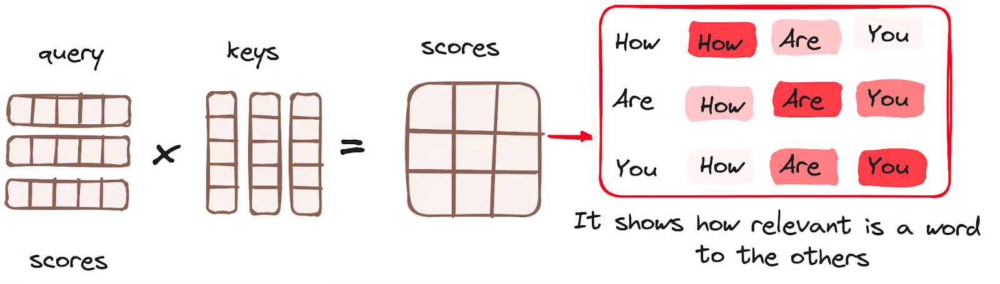
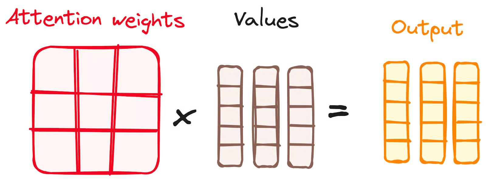
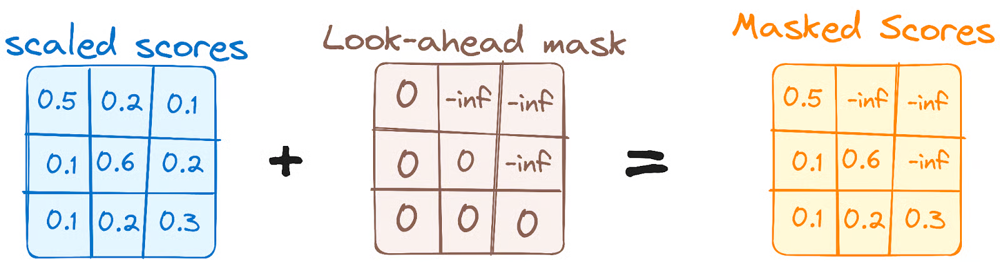

- [LLM](#llm)
  - [LLM Models](#llm-models)
    - [Transformer](#transformer)
      - [Concepts](#concepts)
      - [Source](#source)
      - [Code](#code)
  - [Training](#training)
    - [Zero-shot \& Few-shot](#zero-shot--few-shot)
      - [Concepts](#concepts-1)
      - [Source](#source-1)
      - [Code](#code-1)
  - [Reinforcement Learning](#reinforcement-learning)
    - [Q-learning](#q-learning)
      - [Concepts](#concepts-2)
      - [Source](#source-2)
      - [Code](#code-2)
    - [RLHF](#rlhf)
      - [Concepts](#concepts-3)
      - [Source](#source-3)
      - [Code](#code-3)
  - [Local Deployment](#local-deployment)
    - [Ollama](#ollama)
      - [Concepts](#concepts-4)
      - [Source](#source-4)
      - [Code](#code-4)
    - [vLLM](#vllm)
      - [Concepts](#concepts-5)
      - [Source](#source-5)
      - [Code](#code-5)


# LLM

## LLM Models

### Transformer

#### Concepts

Use translation tasks as an example.

* The input (encoder input) and output (decoder input) are both sentences. Each word is a vector $\in \R^d$, d is the model dimension (embedding dimension). So the input and output are matrices $\in \R^{l \times d}$, l is the sentence length (word numbers in a sentence).
* The output probabilities (label) is a vetor $\in \R^l$ instead of a single number. The output and the Label are the same sentence, just offset (right) by one position, which is called Teacher Forcing.
* Example: To translate "I love cats" (English) to "Me gustan los gatos" (Spanish), your training data consists of three specific tensors:
  Encoder Input:	[I, love, cats, <EOS>]	
  
  Decoder Input:	[<SOS>, Me, gustan, los, gatos]	
  
  Label (Target):	[Me, gustan, los, gatos, <EOS>]	

* The encoder attention layer is the original one. The Masked attention layer is applied with mask to block out the upper triangle in the attention score matrix. (When the model is processing the word at position $i$, the mask blocks out all positions from $i+1$ to $n$.)
  
  

  

  This figure is wrong. the values should be 3 $\times$ 5 (also the output), otherwise it violates the matrix multiplication rule.

  
* The masking mechanism both exist in training and inference. (the code and structure is the same between training and inference.) 
* The encoder-decoder attention layer in decoder uses the output of the masked attention layer in decoder as the query and the output of encoder as the key and the value.
* The entire sentence is feeded to the decoder input in training, while the tokens are generated one by one and feed back to the decoder as input **auto-regressively** during inference. But note that the label array is always the same shape! (as well as the input and output.) There might be a extra process to feed those output tokens back.
* The query would be shorten (without the bottom part) during the inference, so the socre matrix would only have the several upper rows being non-zero. Then multiplied by the values, the output will also be shorten (without the bottom part), the same length as the query. Considering the Teacher Forcing method, the last word output would be the predition of the next word!
* GPT only uses self-attention in the decoder (with masking). It does not use encoder-decoder attention. BERT only uses self-attention in the encoder. It does not use encoder-decoder attention either. Encoder-decoder attention is used in models like the original Transformer (e.g., for translation tasks), but not in GPT or BERT.

<br>

#### Source

[Attention Is All You Need](https://arxiv.org/pdf/1706.03762)

[How Transformers Work](https://www.datacamp.com/tutorial/how-transformers-work)

[TRANSFORMER EXPLAINER](https://poloclub.github.io/transformer-explainer/)

[LLM Visualization](https://bbycroft.net/llm)

<br>

#### Code

<br>

---

## Training

### Zero-shot & Few-shot

#### Concepts

* It seems they are also concepts not only in prompting as the following source links, but also in fine-tuning means that the model hasn't been fine-tuned on the new task and is instead evaluated on the new task directly without any task-specific adjustments.

<br>

#### Source

[Examples in Prompts: From Zero-Shot to Few-Shot](https://learnprompting.org/docs/basics/few_shot?srsltid=AfmBOopNonF7nPXkgm5hcX3rl1XzUZziMf1nHvakJ_NdLj1OX9p1eg3N)

[What Are Zero-Shot Prompting and Few-Shot Prompting](https://machinelearningmastery.com/what-are-zero-shot-prompting-and-few-shot-prompting/)

<br>

#### Code

[RL_maze](../code/RL_maze.py)

<br>

---

## Reinforcement Learning

### Q-learning

#### Concepts

<br>

#### Source

[Geeksforgeeks Reinforcement Learning](https://www.geeksforgeeks.org/machine-learning/what-is-reinforcement-learning/)

<br>

#### Code

[RL_maze](../code/RL_maze.py)

<br>

---

### RLHF

#### Concepts

1. RLHF
2. PPO
3. DPO

<br>

#### Source

[Is DPO Superior to PPO for LLM Alignment? A Comprehensive Study](https://arxiv.org/pdf/2404.10719)

ICML 2026 Cited by 244

[Direct Preference Optimization:Your Language Model is Secretly a Reward Model](https://arxiv.org/pdf/2305.18290#page=4.22)

NeurIPS 2023 Cited by 7219


<br>

#### Code

<br>

---

## Local Deployment

### Ollama

#### Concepts

* Download the ollama on https://ollama.com/.
* Open a terminal and input 'ollama --version' to check if the downloading is successful.
* Download the LLMs by inputing 'ollama pull llama3'
* Open a teminal and input: 
  ```python
  curl http://localhost:11434/api/generate -d '{
  "model": "llama3",
  "prompt": "Why is the sky blue?"}'
  ```
  to try to interact with the LLMs.
* There is also a UI interface in ollama in which users can talk with the LLMs, including the pulled ones, in a breifer way.


<br>

#### Source

[Ollama API](https://docs.ollama.com/api/introduction)

[Run LLMs Locally: 6 Simple Methods](https://www.datacamp.com/tutorial/run-llms-locally-tutorial)

[VS Code Integration](https://docs.ollama.com/integrations/vscode)

<br>

#### Code

<br>

---

### vLLM

#### Concepts

<br>

#### Source

[Performance vs Practicality: A Comparison of vLLM and Ollama](https://robert-mcdermott.medium.com/performance-vs-practicality-a-comparison-of-vllm-and-ollama-104acad250fd)

<br>

#### Code

<br>

---