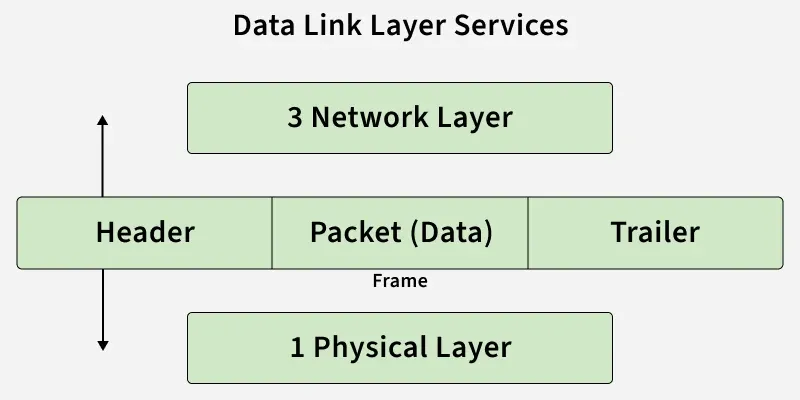
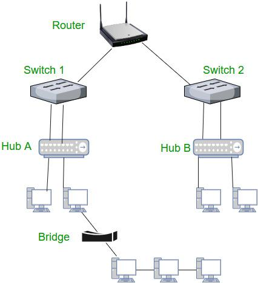

- [Computer Network](#computer-network)
  - [OSI Model](#osi-model)
    - [Physical Layer](#physical-layer)
      - [Topiologies](#topiologies)
      - [Protocols](#protocols)
      - [Hardware](#hardware)
    - [Data Link Layer](#data-link-layer)
      - [Data](#data)
      - [Protocols](#protocols-1)
      - [Hardware](#hardware-1)
    - [Network Layer](#network-layer)
      - [Data](#data-1)
      - [Protocols](#protocols-2)
      - [Hardware](#hardware-2)
    - [Transport Layer](#transport-layer)
      - [Protocols](#protocols-3)
    - [Session Layer](#session-layer)
    - [Presentation Layer](#presentation-layer)
      - [Protocols](#protocols-4)
    - [Application Layer](#application-layer)
      - [Protocols](#protocols-5)
  - [TCP/IP Model](#tcpip-model)

# Computer Network

## OSI Model

* The OSI (Open Systems Interconnection) Model: a conceptual framework created by the International Organization for Standardization (ISO) to describe how data is transmitted across a network using a structured seven-layer architecture.

[open-systems-interconnection-model-osi](https://www.geeksforgeeks.org/computer-networks/open-systems-interconnection-model-osi/)
        
 

---

### Physical Layer

[physical-layer-in-osi-model](https://www.geeksforgeeks.org/computer-networks/physical-layer-in-osi-model/)

 

---

#### Topiologies

* Point To Point Topology
* Bus Topology/line topology
* Ring Topology	
* Star Topology: all the devices are connected to a single hub through a cable. Most commonly used in real life.
* Mesh Topology	
* Tree Topology	
* Hybrid Topology

[types-of-network-topology](https://www.geeksforgeeks.org/computer-networks/types-of-network-topology/)

 

---

#### Protocols

* Ethernet (IEEE 802.3) : Widely used for wired networks.
* Wi-Fi (IEEE 802.11) : For wireless communication.
* Bluetooth (IEEE 802.15.1) : Short-range wireless communication.
* USB (Universal Serial Bus) : For connecting devices over short distances.
  
 

---

#### Hardware

* Hubs: A hub has multiple ports. It broadcasts or sends the message to each port. A hub is a multi-port repeater.

  [what-is-network-hub-and-how-it-works](https://www.geeksforgeeks.org/computer-networks/what-is-network-hub-and-how-it-works/)

* Repeaters: a network device that regenerates weakened or corrupted signals to restore them to their original form before retransmission.

  [repeaters-in-computer-network](https://www.geeksforgeeks.org/computer-networks/repeaters-in-computer-network/)

* Modems (Modulator/Demodulator): a networking device that is used to connect devices connected in the network to the internet. The main function of a modem is to convert the analog signals that come from optical cables/telephone wire/satellite dishes into a digital form.

  [what-is-modem](https://www.geeksforgeeks.org/computer-networks/what-is-modem/)

  * Modulation: The physical copper wire destroys that neat digital signal the moment it tries to travel over a distance because of the Resistance, Capacitance and Wireless Effect. So the digital signals (square form) needs to be converted into analog signals (wave form) using Fourier Transform. Also, Waveform is More Efficient Than Digital Form: a raw digital signal (a single stream of high/low voltages) is inherently limited because it can only carry one bit stream at a time. By converting those digital streams into complex analog waveforms, we can mix multiple frequencies together.
    * Types of Modulation/0&1 representation in analog signals
      * Amplitude Modulation/low and high Amplitude
      * Frequency Modulation/low and high Frequency
      * Phase Modulation/a $180^\circ$ phase shift

    [what-is-modulation](https://www.geeksforgeeks.org/computer-networks/what-is-modulation/)

  * Bandwidth
    * $$\text{Bandwidth} = \text{Highest Frequency} - \text{Lowest Frequency}$$
    * Units: Hz
    * Frequency cannot Be Split Unlimitedly in industry.
      $$c = \lambda \cdot f$$, as the frequency ($f$) gets smaller, the wavelength ($\lambda$) must get longer (larger) to compensate. If you split a channel down to a microscopic width (say, $0.001 \text{ Hz}$ wide), a single wave cycle takes a long time to complete. To detect a change in that wave (a 1 or a 0), the receiver might have to listen to the signal for minutes or hours just to read a single bit. 

      [introduction-to-bandwidth](https://www.geeksforgeeks.org/computer-networks/introduction-to-bandwidth/)

  * Data Rate/Speed
    * $$\text{Data Rate (bps)} = \text{Bandwidth (Hz)} \times \log_2\left(1 + \frac{\text{Signal}}{\text{Noise}}\right)$$ (Shannon's Law)
    * Units: bps (Bits per second)/Mbps (Megabits per second)/Gbps (Gigabits per second) 

* Cables:

  [types-of-ethernet-cable](https://www.geeksforgeeks.org/computer-networks/types-of-ethernet-cable/)

 

---

### Data Link Layer

[data-link-layer](https://www.geeksforgeeks.org/computer-networks/data-link-layer/)

 

---

#### Data

* Frame
  * The Header (The Front): The header contains the organizational information the local network hardware needs to physically move the data. It includes: Source MAC Address, Destination MAC Address, Type/Length.
  * The Payload (The Middle): This is the actual Packet (Layer 3 data) that was handed down from above. The Data Link Layer doesn’t look at what’s inside this packet; it just treats it as cargo to be delivered.
  * The Trailer (The Back): While Layer 3 packets only have headers, Layer 2 frames add a Trailer at the very end. The trailer is almost exclusively used for Error Detection.

  

  [framing-in-data-link-layer](https://www.geeksforgeeks.org/computer-networks/framing-in-data-link-layer/)

 

---

#### Protocols

* ARP (Address Resolution Protocol): Maps IP addresses to MAC addresses within a local network.
  * MAC Addresses: unique 48-bit (12-digit hexadecimal number, Hexadecimal is a base-16 numbering system, while binary is base-2. Because $2^4 = 16$, exactly 4 binary bits are required to represent a single hexadecimal digit.) hardware numbers of a computer that are embedded into a network card (known as a Network Interface Card) during manufacturing. Example of MAC Address: 01-80-C2-00-00-00

    [mac-address-in-computer-network](https://www.geeksforgeeks.org/computer-networks/mac-address-in-computer-network/)

  [arp-protocol](https://www.geeksforgeeks.org/computer-networks/arp-protocol/)

 

---

#### Hardware

* Switch: It uses switching table to find out the correct destination. It is responsible for filtering and forwarding the packets between LAN (Local Area Network) segments based on MAC address. Since the switch inputs the data from multiple ports thus it is also called multiport bridge.
* Bridge: A bridge is basically a device which is responsible for dividing a single network into various network segments. The bridge takes the decision that the incoming network traffic has to be forwarded or filtered. Bridge is also responsible for maintaining the MAC (media access control) address table.

[difference-between-switch-and-bridge](https://www.geeksforgeeks.org/computer-networks/difference-between-switch-and-bridge/)

 

---

### Network Layer

[network-layer-in-osi-model](https://www.geeksforgeeks.org/computer-networks/network-layer-in-osi-model//)

 

---

#### Data

* Packet: A TCP/IP packet is the smallest unit of data transmitted over a network. It contains both user data and control information, allowing devices to communicate reliably and efficiently.

  [tcp-ip-packet-format](https://www.geeksforgeeks.org/computer-networks/tcp-ip-packet-format/)

* Fragmentation: Some networks have a maximum transmission unit (MTU) that defines the largest packet size they can handle. If a packet exceeds the MTU, the network layer: Fragments the packet into smaller pieces. Adds headers to each fragment for identification and sequencing. At the destination, the fragments are reassembled into the original packet. This ensures compatibility with networks of varying capabilities without data loss.

  [fragmentation-network-layer](https://www.geeksforgeeks.org/computer-networks/fragmentation-network-layer/)

 

---

#### Protocols

* IP (Internet Protocol - IPv4/IPv6): Provides logical addressing and delivers packets across networks.
  * IPv4: This is the most common form of IP Address. It consists of 4 sets of octets separated by dots (32-bit). Each octet represents eight bits, or a byte, and can take a value from 0 to 255 ($2^8$). ($$\text{1 Octet} = \text{1 Byte} = \text{8 Bits}$$). This format can support over 4 billion ($2^32$) unique addresses. Example of IPv4 Address: 192.168.1.1
  * IPv6: IPv6 addresses were created to deal with the shortage of IPv4 addresses. They use 128 bits instead of 32, offering a vastly greater number of possible addresses. These addresses are expressed as eight groups of four hexadecimal digits, each group representing 16 bits. The groups are separated by colons. Example of IPv6 Address: 2001:0db8:85a3:0000:0000:8a2e:0370:7334

    [what-is-an-ip-address](https://www.geeksforgeeks.org/computer-science-fundamentals/what-is-an-ip-address/)

  * Subnetting: the process of dividing a large IP network into smaller logical networks called subnets. Subnetting enables a single IP network to be divided into smaller, logical networks, allowing for efficient IP address usage, improved performance, and enhanced security control.
    * IP Addressing: 
      * Network portion: Identifies the network to which the device belong
      * Host portion: Identifies the specific device within that network
    * In classful IPv4 addressing, IP addresses are divided into classes based on how many bits are used for the network ID and host ID.
      * Class A: 8-bit network ID, 24-bit host ID
      * Class B: 16-bit network ID, 16-bit host ID
      * Class C: 24-bit network ID, 8-bit host ID
    * Subnet Mask: a 32-bit number used in IP addressing to separate the network portion of an IP address from the host portion. 
    * CIDR Notation: A Simplified Approach to Subnetting: Instead of using a long subnet mask (e.g., 255.255.255.0), CIDR uses a simple format like /24. The number after the slash (/n) represents the number of bits used for the network portion of the IP address.

    [introduction-to-subnetting](https://www.geeksforgeeks.org/computer-networks/introduction-to-subnetting/)

* NAT (Network Address Translation): Converts private IP addresses to public IPs, conserving addresses and improving security.

  [network-address-translation-nat](https://www.geeksforgeeks.org/computer-networks/network-address-translation-nat/)

 

---

#### Hardware

* Router: A router is a networking device that forwards data packets between different computer networks. It connects multiple packet-switched networks or subnetworks, managing traffic by directing packets to their intended IP addresses. Routers allow multiple devices to share an Internet connection efficiently.

[introduction-of-a-router](https://www.geeksforgeeks.org/computer-networks/introduction-of-a-router/)

 

---

### Transport Layer

[transport-layer-in-osi-model](https://www.geeksforgeeks.org/computer-networks/transport-layer-in-osi-model/)

 

---

#### Protocols

* Transmission Control Protocol (TCP): allows devices to communicate reliably over a network. It ensures that data reaches the destination correctly and in the right order, even if parts of the network are slow or unreliable.
  * Connection Establishment (Three-Way Handshake)
    * SYN (Synchronize): The sender sends a SYN segment to the receiver to request a connection.
    * SYN-ACK (Synchronize-Acknowledge): The receiver responds with a SYN-ACK segment, acknowledging the request and agreeing to the connection.
    * ACK (Acknowledge): The sender replies with an ACK, confirming the connection is established.
  * Connection Termination (Four-Way Handshake)
    * FIN (Finish): The sender who wants to close the connection sends a FIN segment to the receiver.
    * ACK (Acknowledge): The receiver acknowledges the FIN with an ACK.
    * FIN (Finish) from Receiver: The receiver then sends its own FIN when it is ready to close the connection.
    * ACK (Acknowledge): The sender responds with an ACK, completing the termination.
  
  [what-is-transmission-control-protocol-tcp](https://www.geeksforgeeks.org/computer-networks/what-is-transmission-control-protocol-tcp/)

* User Datagram Protocol (UDP): provides fast, connectionless, and lightweight communication between processes. It does not guarantee delivery, order, or error checking, making it suitable for real-time and time-sensitive applications such as video streaming, DNS, and VoIP.

  [user-datagram-protocol-udp](https://www.geeksforgeeks.org/computer-networks/user-datagram-protocol-udp/)

 

---

### Session Layer

[session-layer-in-osi-model](https://www.geeksforgeeks.org/computer-networks/session-layer-in-osi-model/)

 

---

### Presentation Layer

[presentation-layer-in-osi-model](https://www.geeksforgeeks.org/computer-networks/presentation-layer-in-osi-model/)

 

---

#### Protocols

* Secure Sockets Layer (SSL): an Internet security protocol that encrypts data to ensure secure communication between devices over a network.
  * The "Hello": Client and server exchange hello packets, protocol versions and cipher suites.
  * The Certificate & Public Key (Authentication): Server sends its certificate and server’s Public Key, which is digitally signed by a trusted third party (a Certificate Authority). Browser checks this certificate.
  * Generating the Secret Key (Asymmetric Encryption): Browser creates a random, unique string of data called a Pre-Master Secret. The browser takes the server’s Public Key (from the certificate) and uses it to encrypt this secret code. Once encrypted with the public key, only the server's matching Private Key can decrypt it. The browser sends this encrypted secret over to the server.
  * The Shared Session Key: The server uses its private key to decrypt the message and grab the secret code. Now, both the browser and the server have the exact same secret code, but no one else on the internet intercepted it. They use this code to generate a Session Key. From this exact moment forward, the slow, complex asymmetric encryption is turned off.

  [secure-socket-layer-ssl](https://www.geeksforgeeks.org/computer-networks/secure-socket-layer-ssl/)

* Transport Layer Security (TLS): The modern, more secure successor to SSL.

 

---

### Application Layer

[application-layer-in-osi-model](https://www.geeksforgeeks.org/computer-networks/application-layer-in-osi-model/)

 

---

#### Protocols

* Email Services: Provides the ability to send, receive, and store email messages over the network.
  * SMTP (Simple Mail Transfer Protocol): For sending emails.
  * POP3 (Post Office Protocol v3): For retrieving emails from a server.
  * IMAP (Internet Message Access Protocol): For managing emails on the server.
* File Transfer Services: Allows the uploading, downloading, and management of files between systems.
  * FTP (File Transfer Protocol): Enables file sharing and transfers.
  * TFTP (Trivial File Transfer Protocol): A simplified, connectionless version of FTP.
* Web Services: Supports communication between browsers and servers to access web content.
  * HTTP (Hypertext Transfer Protocol): For accessing websites.
    * Cookies (web cookie, browser cookie): a little piece of data that a server transmits to a user's web browser. When making subsequent queries, the browser may keep the cookie and transmit it back to the same server. An HTTP cookie is typically used, for example, to maintain a user's login state and to determine whether two requests originate from the same browser.Thee stateless HTTP protocol, retains stateful information.
    * requests:
      * GET Request: A GET request retrieves data from the server, sends data through the URL, is cacheable, and commonly returns status.

      [different-kinds-of-http-requests](https://www.geeksforgeeks.org/node-js/different-kinds-of-http-requests/)

    * HTTP Response
      * HTTP Status Code: A number that tells you if the request was successful or not.
        * Informational (1xx): These codes just give you information (e.g., 100 Continue means the request is still being processed).
        * Successful(2xx): These codes tell you everything went fine (e.g., 200 OK means the request was successful).
        * Redirection(3xx): These codes tell the browser to take additional action (e.g., 301 Moved Permanently means the requested page has moved to a new address).
        * Client Error (4xx): These codes indicate that there was a problem with your request (e.g., 404 Not Found means the page doesn’t exist).
        * Server Error (5xx): These codes tell you that something went wrong on the server side (e.g., 500 Internal Server Error means the server had an issue processing the request).
      * Response Headers: Information about the response, like what kind of data is being sent (e.g., Content-Type: text/html means it’s an HTML page).
      * Response Body: The content that the server sends back (e.g., HTML code that the browser will use to display the webpage).

    [http-full-form](https://www.geeksforgeeks.org/blogs/http-full-form/)

  * HTTPS (HTTP Secure): Ensures secure web communication through encryption.
* Remote Access Services: Enables users to access devices and applications on a remote network.
  * Telnet: Provides remote command-line access.
  * SSH (Secure Shell): Provides secure remote access by encrypting the communication.

    [introduction-to-ssh-secure-shell-keys](https://www.geeksforgeeks.org/computer-networks/introduction-to-ssh-secure-shell-keys/)
    
* Domain Name Services: Resolves human-readable domain names (e.g., google.com) into IP addresses for routing.
  * DNS (Domain Name System): Translation of human-readable domain names into IP addresses enables computers to communicate over the internet, which operates in a hierarchical and distributed manner while improving performance through caching.
  * Structure of DNS:
    * Root: The topmost level of the DNS hierarchy. Represented by a dot (.) at the end of a domain name 
    * Top-Level Domains (TLDs): The level directly below the root that defines domain extensions. Includes extensions like .com, .org, .net, .edu 
    * Second-Level Domains: The main domain name registered by an organization. Appears before the TLD (e.g., "example" in example.com) 
    * Subdomains: Extensions of the main domain used for organization. Examples: www, mail, blog
    * Hostnames: Identifies specific servers or devices within a domain. Examples: web1, mailserver, ftp
      
    [domain-name-system-dns-in-application-layer](https://www.geeksforgeeks.org/computer-networks/domain-name-system-dns-in-application-layer/)

 

---

## TCP/IP Model

* Mapping with OSI Model:
  * Application Layer	
    * Application Layer	
    * Presentation Layer	
    * Session Layer	
  * Transport Layer	
    * Transport Layer	
  * Internet Layer	
    * Network Layer	
  * Link Layer	
    * Data Link Layer	
    * Physical Layer	

 

---