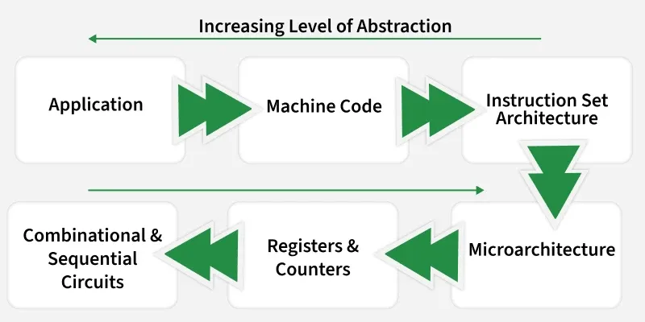

- [Computer Organization and Architecture](#computer-organization-and-architecture)
  - [Instruction Set Architecture](#instruction-set-architecture)

# Computer Organization and Architecture

[computer-organization-and-architecture-tutorials](https://www.geeksforgeeks.org/computer-organization-architecture/computer-organization-and-architecture-tutorials/)

 

---

## Instruction Set Architecture

* Instruction Set Architecture (ISA) is the language of the CPU that tells it what operations it can perform, such as adding numbers, loading data, or jumping to another instruction.
* Some Popular ISAs are x86 (PCs), ARM (phones), MIPS (education), RISC-V (open source).

[microarchitecture-and-instruction-set-architecture](https://www.geeksforgeeks.org/computer-organization-architecture/microarchitecture-and-instruction-set-architecture/)

 

---