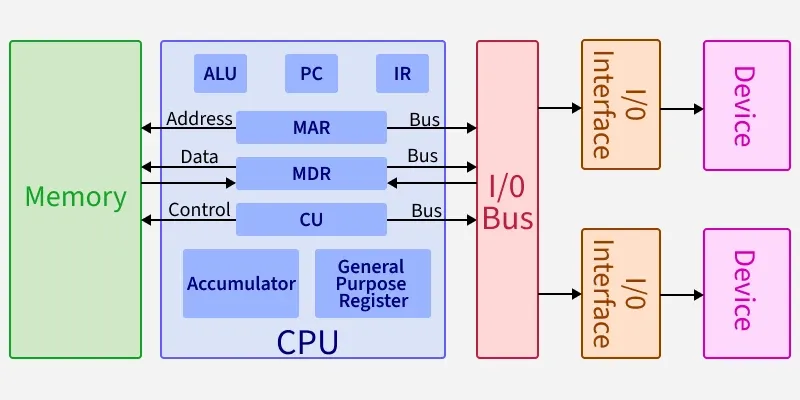
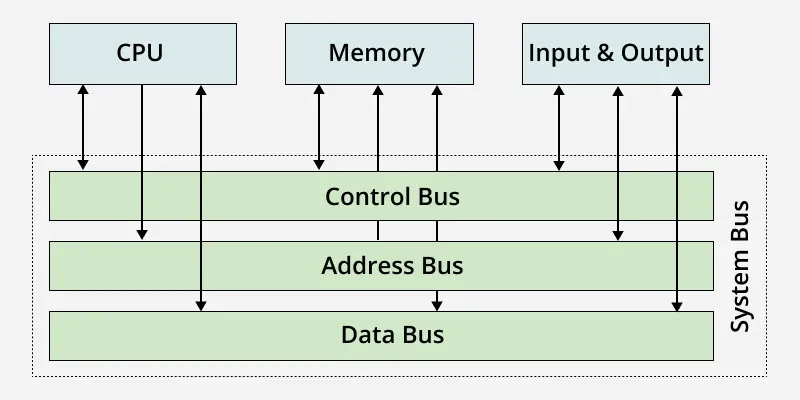
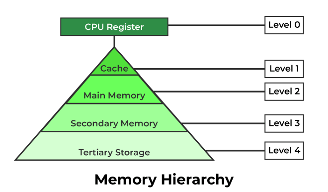
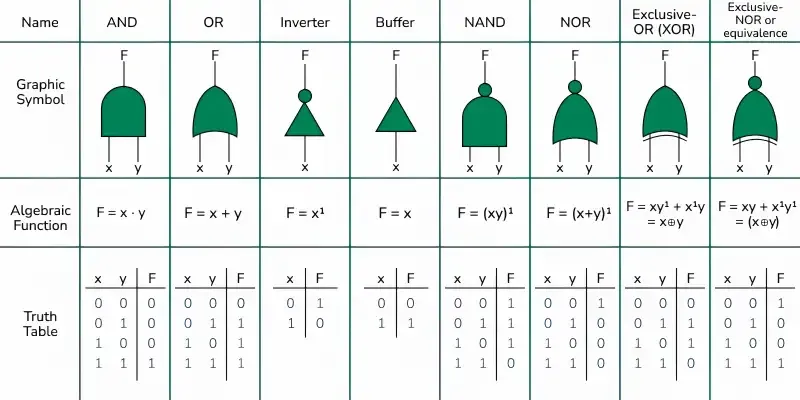

- [Computer Organization and Architecture](#computer-organization-and-architecture)
  - [Computer Structure](#computer-structure)
    - [CPU](#cpu)
      - [ALU](#alu)
      - [CU](#cu)
      - [Register](#register)
    - [Bus](#bus)
    - [Memeroy](#memeroy)
      - [Cache Memory](#cache-memory)
      - [Primary Memory](#primary-memory)
    - [Secondary Memory](#secondary-memory)
    - [Flip-Flop](#flip-flop)
  - [Logic Gates](#logic-gates)
  - [Numbering System](#numbering-system)
  - [Fixed \& Floating-Point Formats](#fixed--floating-point-formats)
  - [Instruction Set Architecture](#instruction-set-architecture)

# Computer Organization and Architecture

[computer-organization-and-architecture-tutorials](https://www.geeksforgeeks.org/computer-organization-architecture/computer-organization-and-architecture-tutorials/)

 

---

## Computer Structure

* Von Neumann architecture: instructions and data are stored in the same memory space. This means the CPU fetches both instructions and data from the same  memory, using the same pathways.
* Von Neumann bottleneck: Whatever we do to enhance performance, we cannot get away from the fact that instructions can only be done one at a time and can only be carried out sequentially. Both of these factors hold back the competence of the CPU. This is commonly referred to as the 'Von Neumann bottleneck'. We can provide a Von Neumann processor with more cache, more RAM, or faster components but if original gains are to be made in CPU performance then an influential inspection needs to take place of CPU configuration. 

[computer-organization-von-neumann-architecture](https://www.geeksforgeeks.org/computer-organization-architecture/computer-organization-von-neumann-architecture/)

* Harvard architecture: program instructions and data are stored in separate memory units that are accessed through independent buses. This separation allows the processor to fetch instructions and access data simultaneously, which helps avoid the bottleneck present in traditional Von Neumann systems.
* Implementing a pure Harvard architecture for a general-purpose PC introduces major real-world bottlenecks: Inefficient Memory Allocation, Complexity and Cost, Self-Modifying Code & Loading.
  
  Modern CPUs use a Modified Harvard Architecture. At the physical RAM level, everything is Von Neumann (a single shared pool of memory). However, inside the CPU, the Level 1 (L1) Cache is split into an L1i (Instructions) Cache and an L1d (Data) Cache. This gives the CPU the speed benefits of Harvard where it matters most, without the rigid downsides at the system level.

* These architectures originally described the entire computer system, but in modern computing, they are used to describe the internal architecture of the CPU and its caches.

[harvard-architecture](https://www.geeksforgeeks.org/computer-organization-architecture/harvard-architecture/)

 

---

### CPU

* The central processing unit (CPU): the main part of a computer that controls how it works.
  
[central-processing-unit-cpu](https://www.geeksforgeeks.org/computer-science-fundamentals/central-processing-unit-cpu/)
  
 

---

#### ALU

* The arithmetic and logic unit is the part of the CPU that handles the calculations and decision-making tasks. It performs arithmetic operations like addition and subtraction, logical operations such as comparisons, and tasks like shifting bits in data.

[introduction-of-alu-and-data-path](https://www.geeksforgeeks.org/computer-organization-architecture/introduction-of-alu-and-data-path/)

 

---

#### CU

* The control unit manages how the processor works by sending control signals. It decides how data should move inside the computer, controls input and output operations, and fetches the instructions from memory for execution.
  
[introduction-of-control-unit-and-its-design](https://www.geeksforgeeks.org/computer-organization-architecture/introduction-of-control-unit-and-its-design/)

 

---

#### Register

* Registers are the fastest type of memory located inside the CPU. They temporarily store information that the processor is currently working on, making program execution and operations faster and more efficient. Register serve as the CPU's primary working memory.
  * PC (Program Counter): Keeps track of the address of the next instruction to be executed.
  * IR (Instruction Register): Holds the current instruction being executed.
  * MAR (Memory Address Register): Stores the address of the memory location being accessed.
  * MDR (Memory Data Register): Temporarily holds data being transferred to or from memory.
  * Accumulator: A register that stores intermediate results of arithmetic and logic operations.
  * General Purpose Registers: Used for temporary storage of data during processing.

[what-is-register-digital-electronics](https://www.geeksforgeeks.org/electronics-engineering/what-is-register-digital-electronics/)

 

---

### Bus

* The bus is a communication system that transfers data, addresses, and control signals between the CPU, memory, and I/O devices. **In Von Neumann architecture, a single bus is shared for both data and instructions, which can create a bottleneck (known as the Von Neumann bottleneck).**
* Types Of Buses
  * Address Bus
  * Data Bus
  * Control Bus

[what-is-a-computer-bus](https://www.geeksforgeeks.org/computer-organization-architecture/what-is-a-computer-bus/)

 

---

### Memeroy

 

---

#### Cache Memory

* Cache memory (Level 1 Memory): a small, high-speed storage area in a computer. It stores copies of the data from frequently used main memory locations. There are various independent caches in a CPU, which store instructions and data.

[cache-memory-in-computer-organization](https://www.geeksforgeeks.org/computer-organization-architecture/cache-memory-in-computer-organization/)

 

---

#### Primary Memory

* Primary Memory (Main Storage/Level 2 Memory) , which is the part of the computer that stores current data, programs, and instructions. Primary storage is stored in the motherboard which results in the data from and to primary storage can be read and written at a very good pace.
* Classification of Primary Memory:
  * Read-Only Memory (ROM)
  * Random Access Memory (RAM)

[primary-memory](https://www.geeksforgeeks.org/computer-science-fundamentals/primary-memory/)

 

---

### Secondary Memory

* Secondary Memory (Secondary Storage/Level 3 Memory): the storage devices and systems used to store data persistently, even when the computer is powered off. Unlike primary memory (RAM), which is fast and temporary, secondary memory is slower but offers much larger storage capacities.
* Some Examples of secondary memory include hard disk drives (HDDS), solid-state drives (SSDS), optical disks (CDS/DVDS), and external storage devices like USB drives.

[secondary-memory](https://www.geeksforgeeks.org/computer-science-fundamentals/secondary-memory/)

 

---

### Flip-Flop

* The flip-flop is a circuit that maintains a state until directed by input to change the state. A basic flip-flop can be constructed using four-NAND or four-NOR gates. A flip-flop is popularly known as the basic digital memory circuit. It has its two states as logic 1(High) and logic 0 (Low) states.
* Applications:
  * Registers: The Registers are mode from the array of flip flop which are used to store data temporarily.
  * Memory: The Flip Flops are the main components in the memory unit for data storage.

[flip-flop-types-their-conversion-and-applications](https://www.geeksforgeeks.org/digital-logic/flip-flop-types-their-conversion-and-applications/)

 

---

## Logic Gates

* Logic gates are the fundamental components of logic design. Each gate performs a specific logical operation on one or more binary inputs to produce a single output.
  

[what-is-digital-logic](https://www.geeksforgeeks.org/digital-logic/what-is-digital-logic/)

 

---

## Numbering System

* Types of Number Systems:
  * Decimal Number System: base-10
  * Binary Number System: base-2
  * Octal Number System: base-8
  * Hexadecimal Number System: base-16

[number-system-in-maths](https://www.geeksforgeeks.org/maths/number-system-in-maths/)

 

---

## Fixed & Floating-Point Formats

* Fixed-point representation is a method of storing real numbers in a computer system where the position of the decimal (or binary) point is fixed.
  * 1's Complement: Negative numbers are formed by inverting all bits of the positive number, but dual zero representations complicate arithmetic.
  * 2's Complement: Negative numbers are formed by inverting bits and adding 1, giving a single zero and streamlined arithmetic.
  
  [fixed-point-representation](https://www.geeksforgeeks.org/computer-organization-architecture/fixed-point-representation/)

  [difference-between-1s-complement-representation-and-2s-complement-representation-technique](https://www.geeksforgeeks.org/digital-logic/difference-between-1s-complement-representation-and-2s-complement-representation-technique/)

* The floating-point representation is a way to encode numbers in a format that can handle very large and very small values. It is based on scientific notation where numbers are represented as a fraction and an exponent. In computing, this representation allows for a trade-off between range and precision.

  [introduction-of-floating-point-representation](https://www.geeksforgeeks.org/digital-logic/introduction-of-floating-point-representation/)

 

---

## Instruction Set Architecture

* Instruction Set Architecture (ISA) is the language of the CPU that tells it what operations it can perform, such as adding numbers, loading data, or jumping to another instruction.
* Some Popular ISAs are x86 (PCs), ARM (phones), MIPS (education), RISC-V (open source).

[microarchitecture-and-instruction-set-architecture](https://www.geeksforgeeks.org/computer-organization-architecture/microarchitecture-and-instruction-set-architecture/)

 

---