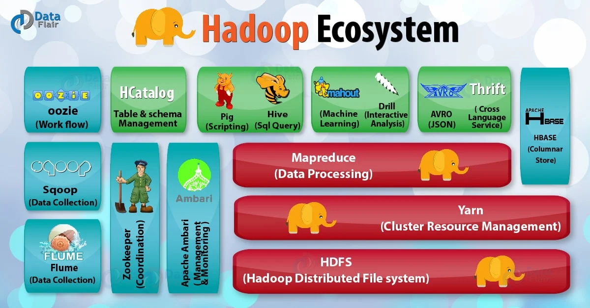

- [Data](#data)
  - [SQL](#sql)
    - [Language](#language)
      - [CTE (Common Table Expression)](#cte-common-table-expression)
      - [CTAS (Create Table As Select)](#ctas-create-table-as-select)
      - [Drop](#drop)
      - [Window Functions](#window-functions)
    - [RDBMS](#rdbms)
      - [Transaction](#transaction)
      - [MySQL](#mysql)
      - [PostgreSQL](#postgresql)
  - [NoSQL](#nosql)
    - [Key-Value Store](#key-value-store)
      - [Redis](#redis)
  - [Storage](#storage)
    - [Kubernetes](#kubernetes)
    - [Cloud](#cloud)
    - [Hadoop](#hadoop)
      - [HDFS](#hdfs)
      - [YARN](#yarn)
      - [Hive](#hive)
  - [Engines](#engines)
    - [MapReduce](#mapreduce)
    - [Spark](#spark)
      - [Dataframe](#dataframe)
      - [API](#api)
      - [Web UI](#web-ui)
      - [Optimization](#optimization)
      - [Engineering praticals](#engineering-praticals)
    - [Presto](#presto)
    - [Doris](#doris)
  - [Pandas](#pandas)
    - [Basic Api](#basic-api)
  - [Excel](#excel)
    - [Shortcuts](#shortcuts)


# Data

## SQL

* Structured Query Language (SQL)

[what-is-sql](https://www.geeksforgeeks.org/sql/what-is-sql/)

<br>

---

### Language
 
#### CTE (Common Table Expression)

* A temporary named query that exists only during the execution of that specific command.
* Syntax: Defined using the WITH keyword.

<br>

---

#### CTAS (Create Table As Select)

* Command used to create a new, permanent table based on the results of a SELECT statement. It combines the table creation and data insertion steps into one efficient move.
* Syntax: CREATE TABLE table_name AS SELECT ...

<br>

---
 
#### Drop

* Drop table: 
  
  ```
  DROP TABLE table_name;
  ```

* Drop partition: 
  
  ```
  Alter TABLE table_name DROP IF EXISTS PARTITION (partition_name=partition);
  ```

[sql-drop-table-statement](https://www.geeksforgeeks.org/sql/sql-drop-table-statement/)

<br>

---

#### Window Functions

* General: 
  
  ```
  SELECT column_name1, 
       window_function(column_name2) 
       OVER (PARTITION BY column_name3 ORDER BY column_name4 ROWS BETWEEN N PRECEDING/CURRENT ROW AND M FOLLOWING) AS new_column
  FROM table_name;
  ```
* Ranking:
  
  Salary | RANK() | DENSE_RANK() | ROW_NUMBER()
  --- | --- | --- | --- 
  50000 | 1 | 1 | 1
  50000 | 1 | 1 | 2
  30000 | 3 | 2 | 3
  20000 | 4 | 3 | 4
  10000 | 5 | 4 | 5

* Difference between the window function and the join operation
  * Use the window function when supported, becuase it's faster. Remember to use 'range between' instead of 'rows between' to avoid collecting the data outside the time window when there is data missing.
  * However, the 'range between' might not be supported to operate on string format on hive sql engine. So use the join operation with a date table as left table to avoid unexpectable data missing problem and be consistent with the ETL expression where most integration is constrained by date.

[window-functions-in-sql](https://www.geeksforgeeks.org/sql/window-functions-in-sql/)

<br>

---

### RDBMS

* Relational Database Management Systems (RDBMS).
* The RDBMS handles the "Front Line". Hadoop handles the "History". When a user buys an item on your website, that transaction goes into an RDBMS (MySQL). It needs to be instant, and it needs to be perfectly accurate (you can't accidentally charge someone twice). Once a day, your company likely runs a job that "exports" all the transactions from the MySQL RDBMS and "dumps" them into Hadoop (HDFS).

[rdbms-full-form](https://www.geeksforgeeks.org/dbms/rdbms-full-form/)

<br>

---

#### Transaction

[sql-transactions](https://www.geeksforgeeks.org/sql/sql-transactions/)

* ACID Properties:
  * Atomicity: Atomicity ensures that a transaction is treated as a single unit of work, and either all operations within the transaction are successfully completed, or none of them are.
  * Consistency: Consistency ensures that a transaction brings the database from one valid state to another. The database must remain in a valid state before and after the transaction.
  * Isolation: Isolation ensures that the operations within a transaction are invisible to other transactions until the transaction is complete.
  * Durability : Durability ensures that once a transaction is committed, its changes are permanent and will survive any system crash or failure.

<br>

---
  
#### MySQL

* OLTP (Online Transaction Processing). Looking up one specific row very fast.
* Spark / Presto /Doris are all OLAP (Online Analytical Processing).
* A classic Relational Database.

<br>

---

#### PostgreSQL

<br>

---

## NoSQL

* Document-Based: JSON-like documents. MongoDB
  * Key-Value Store: Key-Value pairs. Redis
  * Column-Oriented: Columns instead of rows: HBase

  [types-of-nosql-databases](https://www.geeksforgeeks.org/dbms/types-of-nosql-databases/)

<br>

---

### Key-Value Store

#### Redis

<br>

---

## Storage

### Kubernetes

* Kubernetes (k8s)
* While YARN was built specifically to manage Big Data jobs (like Hadoop and Spark), Kubernetes was built to manage Containers (like Docker). Kubernetes is an orchestrator that automates the deployment, scaling, and management of "containerized" applications.
  
[introduction-to-kubernetes-k8s](https://www.geeksforgeeks.org/devops/introduction-to-kubernetes-k8s/)

<br>

---

### Cloud

* Large-scale data centers owned by companies like Amazon (AWS), Google (GCP), or Microsoft (Azure). Instead of your company buying physical servers, bolting them into a rack, and plugging in the power cables, they "rent" virtual versions of those resources over the internet.
* On-Premise: (Private Cloud)
* On-Cloud: (Public Cloud)
  
[on-premises-vs-on-cloud](https://www.geeksforgeeks.org/cloud-computing/on-premises-vs-on-cloud/)

<br>

---

### Hadoop




[hadoop-an-introduction](https://www.geeksforgeeks.org/big-data/hadoop-an-introduction/)

* Command:
  * Difference between 'hadoop fs' and 'hdfs dfs':
    * 'hadoop fs': the older, global script. It can interact with the file system, but it is also used to run MapReduce jobs, manage cluster administrative tasks, and interact with other core Hadoop plumbing. 
    * 'hdfs dfs': the modern, dedicated command used specifically to interact with the Hadoop Distributed File System. 
    * The 'fs' stands for File System. The 'dfs' stands for Distributed File System. 'hadoop' and 'hdfs' are the global, all-encompassing commands for the entire ecosystem, they have several "sub-commands" other than 'fs' and 'dfs'. 'hadoop fs' and 'hdfs dfs' are interchangeable in most scenarios.
  * hdfs dfs -get 'hdfs_file_path' 'local_folder_path': To copy files/folders from hdfs store to local file system.
  * hdfs dfs -put 'local_file_path' 'hdfs_folder_path': To copy files/folders from local file system to hdfs store.
  * hdfs dfs -ls 'path': list all the files on hdfs.
  * hdfs dfs -mkdir 'folder_name': create a directory on hdfs.
  
  [hdfs-commands](https://www.geeksforgeeks.org/linux-unix/hdfs-commands/)


<br>

---

#### HDFS

* Hadoop Distributed File System (HDFS)

<br>

---

#### YARN

* Yet Another Resource Negotiator (YARN)
* Acts like the Operating System of Hadoop, managing resources (CPU, RAM) and scheduling jobs so that different engines (not just MapReduce, but also Spark or Hive) can run on the same data at the same time.

<br>

---

#### Hive

* Hive was created (originally by Facebook) to allow people who know SQL to work with data in Hadoop. Without Hive, you’d have to write complex Java code to count rows. It turns SQL into a series of jobs that run on Hadoop. It alse stores Metadata.

<br>

---

## Engines

### MapReduce

* MapReduce breaks every big data problem into exactly two rigid phases:
  * Map: Each node processes a local piece of data and turns it into "key-value pairs" (e.g., counting words in a single document).
  * Reduce: The system shuffles all identical keys to the same node, where they are aggregated (e.g., summing up all instances of the word "apple").
* Word Count Example:
  * The Map Phase (Local Processing)
  
    Input: "Apple Banana Apple"

    Mapper Output: (Apple, 1), (Banana, 1), (Apple, 1)
  
  * The Shuffle & Sort Phase (The Bridge)
  
    Input: Pairs from all over the cluster.

    Output to Reducer A: (Apple, 1), (Apple, 1)

    Output to Reducer B: (Banana, 1)

  * The Reduce Phase (Aggregation)
  
    Reducer A Calculation: 1 + 1 = 2

    Final Output: (Apple, 2), (Banana, 1)

[understanding-spark-dags](https://medium.com/plumbersofdatascience/understanding-spark-dags-b82020503444)

<br>

---

### Spark

* Difference between mapreduce and spark:
  * MapReduce is "Disk-First," Spark is "Memory-First."
  * In-Memory Processing: Spark keeps data in RAM between different stages of a job. It doesn't write to the disk unless it absolutely has to (e.g., during a Shuffle or if it runs out of memory).
  * DAG vs. Linear: MapReduce is a linear "Map -> Reduce" chain. Spark creates a DAG (Directed Acyclic Graph). This allows Spark to look at your entire query and optimize the path. 
  * Speed: Because it avoids constant disk I/O, Spark is often 10x to 100x faster than MapReduce for many workloads.

<br>

---

#### Dataframe
  
* DataFrame: DataFrame = RDD + Schema
* RDD (Resilient Distributed Dataset): 
  
  When you call .rdd on a DataFrame, you are accessing the underlying collection of Row objects distributed across the cluster.
  Unlike a DataFrame, an RDD does not know anything about the names of the columns or the types of data inside it until it’s actually processed. It is "unstructured" compared to the DataFrame API.

* The Schema: the metadata that defines the structure of your data. If the RDD is the "content," the Schema is the "table definition." It contains Column Names, Data Types, and Nullability.

<br>

---

#### API

* spark.sql(): The result is a DataFrame.
* Export data: 
  * saveAsTextFile: takes the data inside an RDD and writes it out to a storage system as plain text files. 
  * dataframe.write.csv(): If you have columns and types, use this.
  
[sql-getting-started](https://spark.apache.org/docs/latest/sql-getting-started.html)
  
[spark.py](../code/spark.py)

<br>

---

#### Web UI

[web-ui](https://spark.apache.org/docs/latest/web-ui.html)

[understanding-spark-ui](https://medium.com/@himanshukotkar007/understanding-spark-ui-b6250d3bdc47)

<br>

---

#### Optimization

* Sort Merge Join (SMJ):
  * Workflow: 
    * Shuffle: Both datasets are re-partitioned across the cluster based on the join key. This ensures that records with the same key end up on the same node.
    * Sort: Within each partition, the data is sorted by the join key.
    * Merge: The engine iterates through both sorted partitions simultaneously, matching keys (similar to a two-pointer approach).
  * Pros: Highly scalable and robust; can handle massive datasets; does not require fitting an entire table into memory.
  * Cons: Slower due to the high cost of shuffling data over the network and the CPU cost of sorting.
* Data skew: a condition in distributed computing where data is not distributed **evenly** across the cluster. In a distributed system, The job is only as fast as its slowest task. Power Users/Hot Keys and Null Values may lead to this.
* Broadcast Hash Join (BHJ):
  * Workflow: One of the datasets (the "small" one) is collected at the driver and then sent (broadcast) to every worker node in the cluster. Each worker then builds a **hash table** ([hashing](data_structure_and_algorithms.md#hashing)) of this small dataset in memory and performs the join with its local portion of the large dataset. It uses a hash table for O(1) average-time lookups during the join.
  * Pros: Extremely fast; eliminates the need for shuffling and sorting.
  * Cons: Risk of Out of Memory (OOM) errors if the broadcast table is too large.
  * Threshold configuration (spark.sql.autoBroadcastJoinThreshold): If the statistics for one of the tables show it is smaller than this value, the engine will automatically plan a Broadcast Hash Join.

<br>

---

#### Engineering praticals

* Backfilling/Re-triggering tasks based on soft dependencies may lead to data inconsistency between previous and current results.
  
  Because when upstream tasks is not ready is not ready in the same/current day but is ready when re-running, the inconsistency/discrepancies may appear.

<br>

---


### Presto

* a "Massively Parallel Processing" (MPP) SQL engine. It was designed by Facebook specifically to make interactive queries lightning fast.
* Memory-to-Memory: Presto was built from the ground up to be "in-memory." It streams data from the disk directly through the network to the next processing stage without ever stopping to write "checkpoints" to the disk.
* No "Startup" Overhead: When you run a Spark job, YARN often has to "request" containers, start up a Spark context, and coordinate executors. Presto is usually a "long-running" service—it’s already awake and waiting for your command, so it starts immediately.
* Optimized for SQL: Spark is a general-purpose engine (it can do ML, Streaming, etc.). Presto is a SQL specialist. It does one thing—SQL—and it does it perfectly.
* The "All or Nothing" Problem: If a Presto query is running on 100 nodes and one node fails or runs out of memory, the entire query fails. Presto does not have "fault tolerance" for individual tasks.
* The "OOM" (Out of Memory) Safety: Because Presto keeps everything in RAM, a "too large" query will crash the Presto worker. Your platform likely has a Rule Engine that says: "If this query looks like it will touch more than X terabytes, send it to Spark so it doesn't crash the Presto cluster."
  
<br>

---

### Doris

* Apache Doris is a modern, real-time data warehouse designed for OLAP (Online Analytical Processing). In the "Data Warehouse" family, if Hive is the old, reliable storage vault, Doris is the high-speed trading floor.
* When you use Spark or Presto, they are Compute-only engines. Doris, however, follows the Storage-Compute Coupled principle. It owns the physical disks and dictates exactly how every byte is written.
* Doris is its own independent system that is designed to replace the need for both RDBMS and Hadoop for analytical work.
* Doris simplifies the "distributed system" concept into two main components:
  * Frontend (FE): The "Brain." It handles user connections, parses your SQL queries, and creates the plan for how to get the data.
  * Backend (BE): The "Muscle." These live on your physical Blades. They store the actual data and do the heavy lifting of calculating sums, averages, and joins.

<br>

---

## Pandas

### Basic Api

[pandas api reference](https://pandas.pydata.org/docs/reference/index.html)

* filter:
  
  ```python
  df[['name', 'age', 'salary']] # filter multiple columns
  df[(df['age'] > 25) & (df['dept'] == 'IT')] # filter with multiple conditions
  df[df['salary'].isna()] # drop the nan rows in certain columns.
  ```

  [pandas.DataFrame.drop](https://pandas.pydata.org/docs/reference/api/pandas.DataFrame.drop.html#pandas.DataFrame.drop)

* drop:
  
  ```python
  df = df.drop(columns=['B', 'C']) # delete multiple columns
  df = df.drop(index=['B', 'C']) # delete multiple rows
  ```

  [pandas.DataFrame.drop](https://pandas.pydata.org/docs/reference/api/pandas.DataFrame.drop.html#pandas.DataFrame.drop)

* merge: 
  
  ```python
  df_merged = df_left.merge(df_right, on='key', how='inner') # inner join two dataframes
  ```

  [pandas.DataFrame.merge](https://pandas.pydata.org/docs/reference/api/pandas.DataFrame.merge.html#pandas.DataFrame.merge)

* groupby:
  
  ```python
  df_grouped = df.groupby(['category', 'region']).sum() # group by mulitple columns and sum the rest columns
  ```

  [pandas.DataFrame.groupby](https://pandas.pydata.org/docs/reference/api/pandas.DataFrame.groupby.html#pandas.DataFrame.groupby)


<br>

---

## Excel

### Shortcuts

* Hold Control and scroll up or down: Zoom out or in.