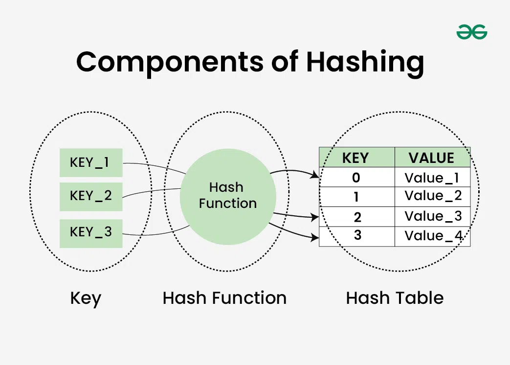

- [Data Structure and Algorithms](#data-structure-and-algorithms)
  - [Hashing](#hashing)
  - [NP-hard](#np-hard)

# Data Structure and Algorithms

[dsa-tutorial-learn-data-structures-and-algorithms](https://www.geeksforgeeks.org/dsa/dsa-tutorial-learn-data-structures-and-algorithms/)

 

---

## Hashing

* Hashing refers to the process of generating a small sized output (that can be used as index in a table) from an input of typically large and variable size. Hashing uses mathematical formulas known as hash functions to do the transformation. This technique determines an index or location for the storage of an item in a data structure called Hash Table.
  
  

  [introduction-to-hashing-2](https://www.geeksforgeeks.org/dsa/introduction-to-hashing-2/)

  [hash-table-data-structure](https://www.geeksforgeeks.org/dsa/hash-table-data-structure/)

* Collision resolution techniques:
  * Separate Chaining: make each cell of the hash table point to a linked list of records that have the same hash function value.
  * Linear Probing: The hash table is searched sequentially that starts from the original location of the hash. If in case the location that we get is already occupied, then we check for the next location.
  
  [collision-resolution-techniques](https://www.geeksforgeeks.org/dsa/collision-resolution-techniques/)

* Load factor = Total elements in hash table/ Size of hash table 
  
  [load-factor-and-rehashing](https://www.geeksforgeeks.org/dsa/load-factor-and-rehashing/)

 

---

## NP-hard

* The P Class: (Easy to Solve)Problems in P (Polynomial time) can be solved efficiently. Mathematically, polynomial time means the time complexity can be written as $O(n^k)$. Examples: Sorting a list, searching for a name in a database, or solving a standard, continuous Linear Program (LP).
* The NP Class: (Easy to Verify)Problems in NP (Nondeterministic Polynomial time) might be incredibly hard to solve, but if someone hands you a piece of paper with a correct solution, you can verify that it is correct very quickly (in polynomial time). P Class is a subset of NP Class. Example: A Sudoku puzzle. Solving a $100 \times 100$ Sudoku grid from scratch is brutal, but checking if a completed grid follows the rules takes seconds.
* NP-Hard Problem: (The Heavy Hitters)A problem is NP-hard if it is at least as hard as the hardest problems in NP.If you find a way to solve an NP-hard problem efficiently, you instantly unlock the key to solving all complex problems in the NP category. As the size of an NP-hard problem grows, the time required to solve it by exact methods typically blows up exponentially ($2^n$). Many NP-Hard problems aren't even in the NP class.
* NP-Complete Problems: problems are the elite squad that belong to both categories. They are inside the NP class (their solutions are easy to verify), and they are NP-Hard (they are as tough as anything in NP). Example: The 0-1 Knapsack Decision Problem ("Can we fit items worth at least $100 without exceeding 20kg?") is NP-Complete. It's a Yes/No question, and if I give you the items, you can easily verify they weigh under 20kg and beat $100.

  [np-hard-class](https://www.geeksforgeeks.org/dsa/np-hard-class/)