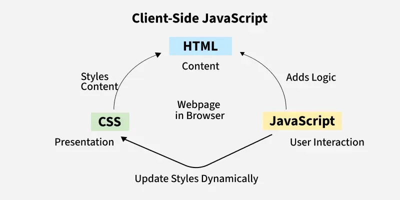
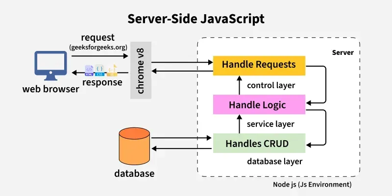

- [Frontend](#frontend)
  - [JavaScript](#javascript)
    - [React](#react)
    - [Next.js](#nextjs)
    - [Node.js](#nodejs)
      - [NPM](#npm)

# Frontend

## JavaScript

* A programming language used to create dynamic content for websites:
  * Client Side: On the client side, JavaScript works along with HTML and CSS.
    * HTML adds structure to a web page.
    * CSS styles it.
    * JavaScript brings it to life by allowing users to interact with elements on the page, such as actions on clicking buttons, filling out forms, and showing animations. 
  * Server Side: On the Server side (on Web Servers), JavaScript is used to access databases, file handling, and security features to send responses, to browsers.
  

[javascript-tutorial](https://www.geeksforgeeks.org/javascript/javascript-tutorial/)

 

---

### React

* A powerful JavaScript library.

[react](https://www.geeksforgeeks.org/reactjs/react/)

 

---

### Next.js

* A powerful React framework.
  
[nextjs-tutorial](https://www.geeksforgeeks.org/nextjs/nextjs-tutorial/)

 

---

### Node.js

* A JavaScript runtime built on Chrome's V8 engine that enables developers to run JavaScript outside the browser to build applications.

[nodejs](https://www.geeksforgeeks.org/node-js/nodejs/)

 

---

#### NPM 

* Node Package Manager (NPM) is the default package manager for Node.js. (The pip for JavaScript).

[node-js-npm-node-package-manager](https://www.geeksforgeeks.org/node-js/node-js-npm-node-package-manager/)

 

---