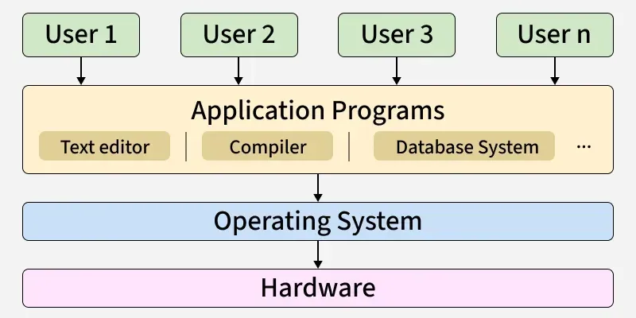
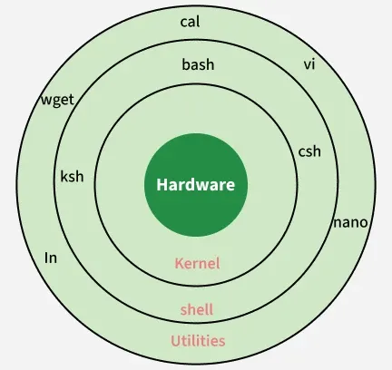
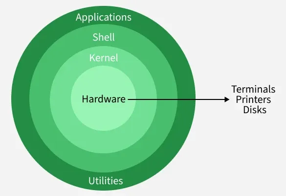
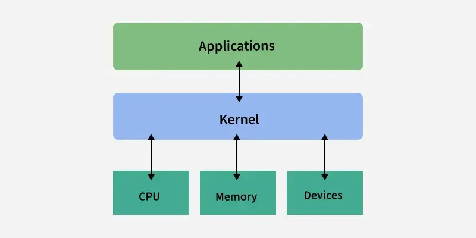
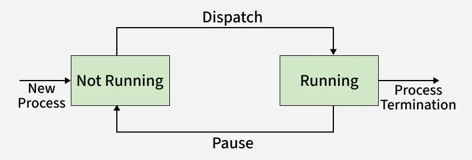
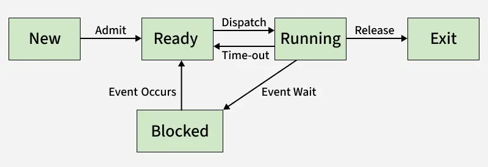
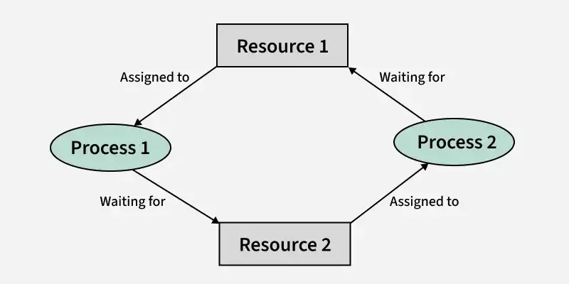

- [Operating System](#operating-system)
  - [Linux](#linux)
  - [Shell](#shell)
      - [Command](#command)
      - [Shell Scripting](#shell-scripting)
      - [SSH (Secure Shell)](#ssh-secure-shell)
  - [Kernel](#kernel)
  - [Process](#process)
    - [Process Scheduling](#process-scheduling)
  - [Thread](#thread)
  - [Mac](#mac)
    - [ShortCuts](#shortcuts)


# Operating System



* Operating System (OS): a software that manages and handles hardware and software resources of a computing device.
* Components: Shell and Kernel.



<br>

---

## Linux

* Architecture: Hardware, Kernel, Shell, Utilities.
* Popular Distributions: Ubuntu, Debian.



[introduction-to-linux-operating-system](https://www.geeksforgeeks.org/linux-unix/introduction-to-linux-operating-system/)

<br>

---

## Shell

* In Linux systems, users communicate with the operating system through a shell, which interprets and executes commands entered in a terminal. The shell acts as an intermediary between the user and the kernel, ensuring that instructions are processed correctly.
* Terminal: Interface used to access the shell
* Shell: Command interpreter that processes user input.
* Common Types of Shells: 
  * Bash (Bourne Again Shell): The most popular and standard shell for most Linux distributions.
  * Zsh (Z Shell): The default shell on modern macOS. It is highly customizable and offers advanced auto-completion features.
  * PowerShell: Microsoft’s advanced shell designed for Windows administration (which works quite differently from Linux shells).
  
[introduction-linux-shell-shell-scripting](https://www.geeksforgeeks.org/linux-unix/introduction-linux-shell-shell-scripting/)

<br>

---

#### Command

* ls: list files.
* du: analyze and report on disk usage within directories and files.
  * -h or --human-readable: Displays sizes in human-readable format, using units such as KB, MB, GB, etc. 
  * -s or --summarize: rovides a summary of the disk usage for the specified directory or file, without displaying individual usage details for subdirectories.
  
  [du-command-linux-examples](https://www.geeksforgeeks.org/linux-unix/du-command-linux-examples/)
  
* pwd: display the path of the working directory. (The relative path is rlative to this path.)
  * . (Single dot): Represents the current folder you are sitting in right now.
  * .. (Double dot): Represents the parent folder (one level up).
  * /: home directory (user folder).
  * ~: root directory.
* cd: change directory.
* mv: move or rename files.
  * mv 'file_name' 'foldername/': move file to a folder.
  * mv 'file_name_1' 'file_name_2': rename a file.
* rm: remove or delete the files.
  * rm - r 'folder_name/': delete the folder recursively.
  * rm 'file_name': delete a file
* mkdir: create new directories or folders.
* cp: copy files or directories.
* grep: search text patterns.
* sed: stream editor, processes text line by line, applying the editing commands you specify. It can also be used for searching, inserting, deleting and modifying text efficiently.
  * sed 's/unix/linux/' geekfile.txt: replaces the word "unix" with "linux" in the file.

  [sed-command-in-linux-unix-with-examples](https://www.geeksforgeeks.org/linux-unix/sed-command-in-linux-unix-with-examples/)

* echo: display text in the terminal.
* cat: display file contents and combine multiple files.
  * cat file_name: View the Content of a Single File
  * cat file_name1 file_name2: View the Content of Multiple Files
  * cat > file_name: Create a New File and Add Content Using cat Command
    * Type your content
    * Press Ctrl + D to save and exit
  * cat file1 file2 > new_file: Copy or Merge File Contents

  [cat-command-in-linux-with-examples](https://www.geeksforgeeks.org/linux-unix/cat-command-in-linux-with-examples/)

* chmod: modify file and directory permissions. It controls who can read, write, or execute a file by setting access rights for the owner, group, and others.
  * r (Read): Permission to look inside the file and see its contents.

    w (Write): Permission to edit, modify, or delete the file.

    x (Execute): Permission to run the file as a program or script.

    Nine characters, first three represent the permision of the owner and middle three represent the permision of the group and last three represent the permision of the others.

  * Example: chmod 745 newfile.txt (chmod -rwxr--r-x newfile.txt)

    Owner (7): rwx : read, write, execute

    Group (4): r-- : read only

    Others (5): r-x : read & execute
  
  * 0:---, 1:--x, 4:r--, 5:r-x, 6:rw-, 7:rwx

  [chmod-command-linux](https://www.geeksforgeeks.org/linux-unix/chmod-command-linux/)

  [set-file-permissions-linux](https://www.geeksforgeeks.org/linux-unix/set-file-permissions-linux/)

* tar: create, view, extract, and manage archive files.
  * Commands:
    * -c: Creates a new archive.
    * -x: Extracts files from an archive.
    * -t: Lists files inside an archive. (Not compression or extraction, just check.)
    * -f: Specifies the name of the archive file.
    * -v: Displays the archiving process.
    * -z: Applies gzip compression.
    * -j: Applies bzip2 compression.
  * Practice:
    * tar -czf file.tar.gz folder_name/: create a file.tar.gz file compressing all files in the directory.
    * tar -czf file.tar.gz *.c: create a file.tar.gz file compressing all .c format files in the directory.
    * tar -cf file.tar *.c: the tar file will be same size as before if not specifies the compression category. It is only archived (.tar) not compressed (.tar.gz).
    * tar -xzf file.tar.gz folder_name/: extract files from file.tar.gz to the directory.
    * tar -tzf file.tar.gz: Lists files inside file.tar.gz.
  
  [tar-command-linux-examples](https://www.geeksforgeeks.org/linux-unix/tar-command-linux-examples/)
  
[GeeksforGeeks – Basic Linux Commands](https://www.geeksforgeeks.org/linux-unix/basic-linux-commands/)

<br>

---

#### Shell Scripting

* shell script: a text file containing a sequence of commands that a Linux or Unix-like operating system can execute.
  * Shebang: '#!/bin/bash', tells the system which interpreter to use to read the file. /bin/bash means "use the Bash shell to run these commands."
  * cron: You can hook a .sh file up to tools like cron (a Linux task scheduler) to run backups, updates, or maintenance scripts automatically
* Variables
  * Global Variables: declared outside any function and can be accessed anywhere in the script,
  * Local variable: declared inside a function using the local keyword and is only accessible within that function.
* Decision Making
  * If–Else Statement: 
  
    if-fi

    if-else-fi

    if-elif-else-fi

    ```
    #!/bin/bash

    Age=17

    if [ "$Age" -ge 18 ]; then
        echo "You can vote"
    else
        echo "You cannot vote"
    fi
    ```

* Loop: 
  
  ```
  #!/bin/bash

  for n in a b c;
  do
    echo $n
  done
  ```

  [bash-scripting-for-loop](https://www.geeksforgeeks.org/linux-unix/bash-scripting-for-loop/)

* Functions

  ```
  #!/bin/bash

  myFunction() {
      echo "Hello World from GeeksforGeeks"
  }

  myFunction
  ```

[bash-scripting-introduction-to-bash-and-bash-scripting](https://www.geeksforgeeks.org/linux-unix/bash-scripting-introduction-to-bash-and-bash-scripting/)

<br>

---

#### SSH (Secure Shell)

* A network protocol that provides a secure way to access a computer (server) over an unsecured network.
  
* SSH Client: A program (like OpenSSH or a built-in terminal) that initiates the connection.

* SSH Server: A background process (daemon) running on the remote machine that listens for incoming connection requests (usually on Port 22).

* SSH Keys: A pair of long strings of characters. You keep the private key secret on your machine and place the public key on any server you want to access.
  
* Use cases
  * Remote Command Line
  * Secure File Transfer: SFTP (SSH File Transfer Protocol)
  * Git Operations.
  * Port Forwarding (Tunneling): 
  
    Forwarding traffic from a local port to a remote server, often used to access services behind a firewall or to secure unencrypted traffic. 
  
    Used in jumper servers. Instead of exposing all your sensitive database servers or application servers to the public internet, you hide them in a private network. You only allow one machine—the jumper—to be reachable from the outside.
  
[what-is-ssh](https://www.cloudflare.com/en-gb/learning/access-management/what-is-ssh/)

<br>

---

## Kernel

* A kernel is the core part of an operating system. The kernel manages system resources, such as the CPU, memory and devices. It handles tasks like running programs, accessing files and connecting to devices like printers and keyboards.


  
[kernel-in-operating-system](https://www.geeksforgeeks.org/operating-systems/kernel-in-operating-system/)

<br>

---

## Process

* A process is a program (an executable binary file) in execution. When the program is loaded into memory and executed, it becomes a process.
* Memory Layout: 
  * Text Section: A text or code segment contains executable instructions. It is typically a read only section
  * Stack: The stack contains temporary data, such as function parameters, returns addresses, and local variables. 
  * Data Section: Contains the global variable. 
  * Heap Section: Dynamically memory allocated to process during its run time.

[process-in-operating-system/](https://www.geeksforgeeks.org/operating-systems/process-in-operating-system/)

### Process Scheduling

* States of a Process: 
  * Two-state:

    

  * five-state: 
  
    
  
  [states-of-a-process-in-operating-systems](https://www.geeksforgeeks.org/operating-systems/states-of-a-process-in-operating-systems/)


* Scheduler and Dispatcher:
  * Scheduler: fundamental components of operating systems responsible for deciding the order in which processes are executed by the CPU.
    * Long-Term (Job) Scheduler : Moves processes from secondary memory (job pool) to main memory (ready queue).
    * Short-Term (CPU) Scheduler : Selects one of the ready processes in memory to execute next.
  * Dispatcher: Once the Short Term Scheduler selects the next process to execute, the Dispatcher takes over. The Dispatcher is a small, specialized program that gives control of the CPU to the process chosen by the short-term scheduler.
    
    [difference-between-dispatcher-and-scheduler](https://www.geeksforgeeks.org/operating-systems/difference-between-dispatcher-and-scheduler/)
    [process-schedulers-in-operating-system](https://www.geeksforgeeks.org/operating-systems/process-schedulers-in-operating-system/)

* Algorithms:
  * Terminologies:
    * Arrival Time: The time at which the process arrives in the ready queue.
    * Completion Time: The time at which the process completes its execution.
    * Burst Time: Time required by a process for CPU execution.
    * Turn Around Time: Time Difference between completion time and arrival time.

      Turn Around Time = Completion Time  –  Arrival Time

    * Waiting Time(W.T): Time Difference between turn around time and burst time.
      
      Waiting Time = Turn Around Time  –  Burst 
  * Preemptive scheduling: the Operating System has the power to interrupt a running process. Even if a process isn't finished with its work, the OS can forcefully take away the CPU and hand it to another process.
    * Round Robin: the system rotates through all the processes, allocating each of them a fixed time slice or "quantum", regardless of their priority.

      [round-robin-scheduling-in-operating-system](https://www.geeksforgeeks.org/operating-systems/round-robin-scheduling-in-operating-system/)

  * Non-preemptive scheduling: once a process gets access to the CPU, it keeps it until it voluntarily gives it up. The OS cannot force it to stop.

  [cpu-scheduling-in-operating-systems](https://www.geeksforgeeks.org/operating-systems/cpu-scheduling-in-operating-systems/)

  * Starvation and Aging: Starvation (or indefinite blocking) occurs in priority scheduling when a low-priority process keeps waiting indefinitely because higher-priority processes continuously get the CPU. To prevent this, operating systems use aging, a technique that gradually increases the priority of waiting processes, ensuring fair execution.

    [starvation-and-aging-in-operating-systems](https://www.geeksforgeeks.org/operating-systems/starvation-and-aging-in-operating-systems/)

* Synchoronization:
  * Inter-Process Communication (IPC): a mechanism that allows processes to communicate and share data with each other while they are running. There are two method of IPC, shared memory and message passing.
    * Shared Memory: rocesses can use shared memory for extracting information as a record from another process as well as for delivering any specific information to other processes.
    * Message Passing:  method where processes communicate by sending and receiving messages to exchange data. Message Passing can be achieved through different methods like Sockets, Message Queues or Pipes.

    [inter-process-communication-ipc](https://www.geeksforgeeks.org/operating-systems/inter-process-communication-ipc/)

  
  * Solutions to Process Synchronization Problems: 
    * Lock: Locks ensure that only one process at a time can enter the critical section. A process must “acquire” the lock before entering, and “release” it after exiting. If another process tries to enter while the lock is held, it must wait.
      * Mutex (Mutual Exclusion Lock): Ensure only one process can enter the critical section at a time.
        * Race Condition: occurs when two or more processes or threads access and modify the same data at the same time, and the final result depends on the order in which they run.

          [race-condition-in-operating-systems](https://www.geeksforgeeks.org/operating-systems/race-condition-in-operating-systems/)   

        * Critical Section: a part of a program where shared resources (like memory, files, or variables) are accessed by multiple processes or threads. To avoid problems such as race conditions and data inconsistency, only one process/thread should execute the critical section at a time using synchronization techniques.

          [critical-section-in-synchronization](https://www.geeksforgeeks.org/operating-systems/critical-section-in-synchronization/)

    [solutions-to-critical-section-problem](https://www.geeksforgeeks.org/operating-systems/solutions-to-critical-section-problem/)

  
  * Deadlock: a state in an operating system where two or more processes are stuck forever because each is waiting for a resource held by another.
  
    
    
    [introduction-of-deadlock-in-operating-system](https://www.geeksforgeeks.org/operating-systems/introduction-of-deadlock-in-operating-system/)

## Thread

* Thread: a single sequence stream within a process and is called a lightweight process because it is smaller and faster. It allows multiple tasks to run simultaneously, improving program efficiency.
* Components:
  * Stack Space: Stores local variables, function calls, and return addresses specific to the thread.
  * Register Set: Hold temporary data and intermediate results for the thread's execution.
  * Program Counter: Tracks the current instruction being executed by the thread.
* Process vs Thread
  * The primary difference is that threads within the same process run in a shared memory space, while processes run in separate memory spaces.
  
  [difference-between-process-and-thread](https://www.geeksforgeeks.org/operating-systems/difference-between-process-and-thread/)

## Mac

### ShortCuts

* Command (⌘) + Spacebar: open Spotlight Search.
* Command (⌘) + Shift + G: open the "Go to Folder" search bar.
* Command (⌘) + Shift + H: open a new Finder window directed straight to your home folder.
* Command + Shift + Period (.): toggle hidden files in macOS Finder.