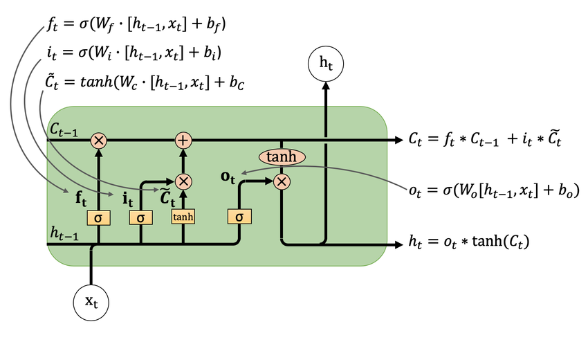
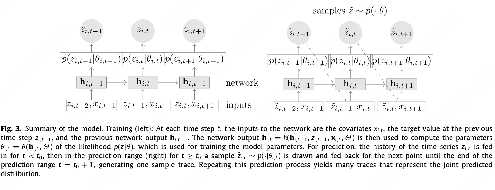
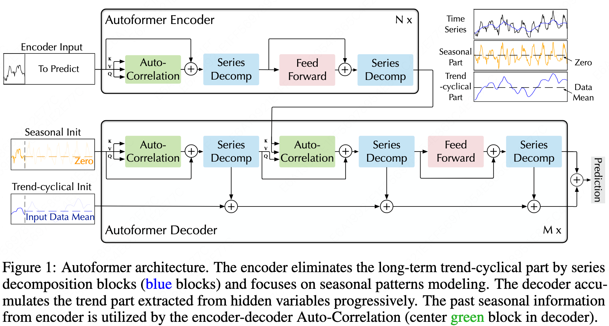
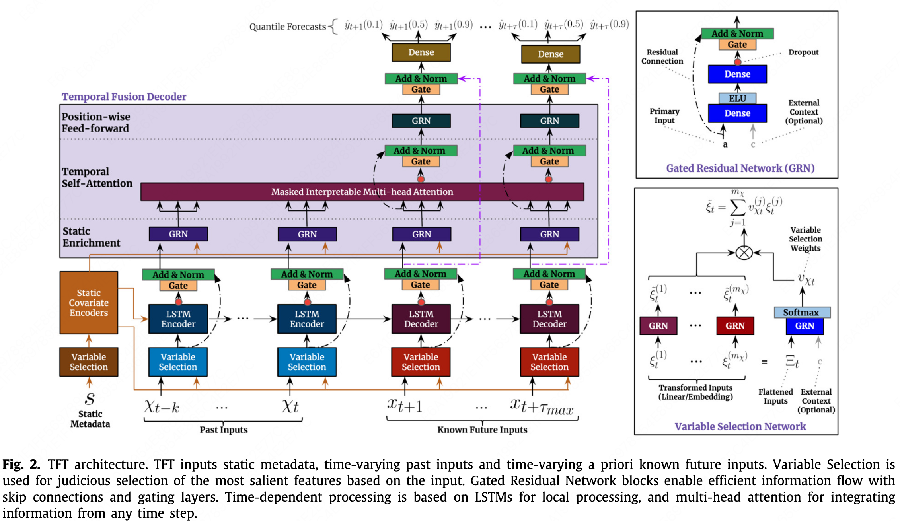
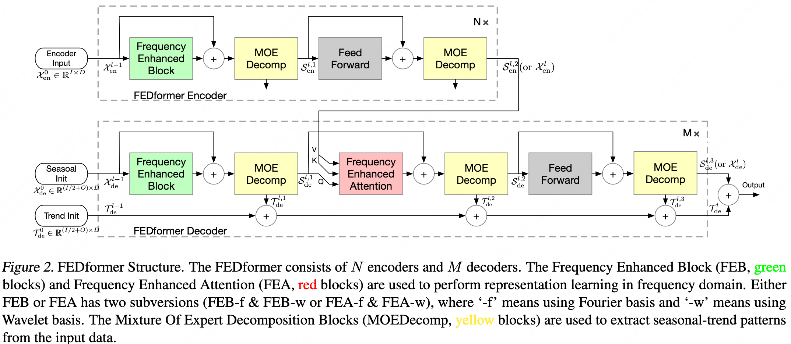
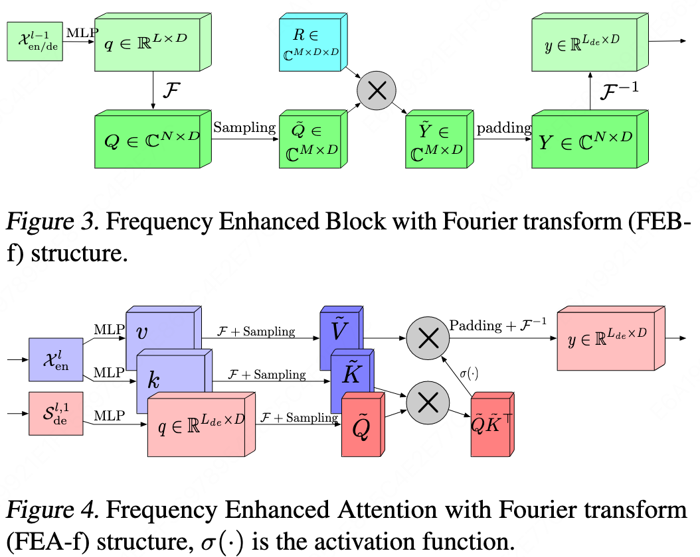
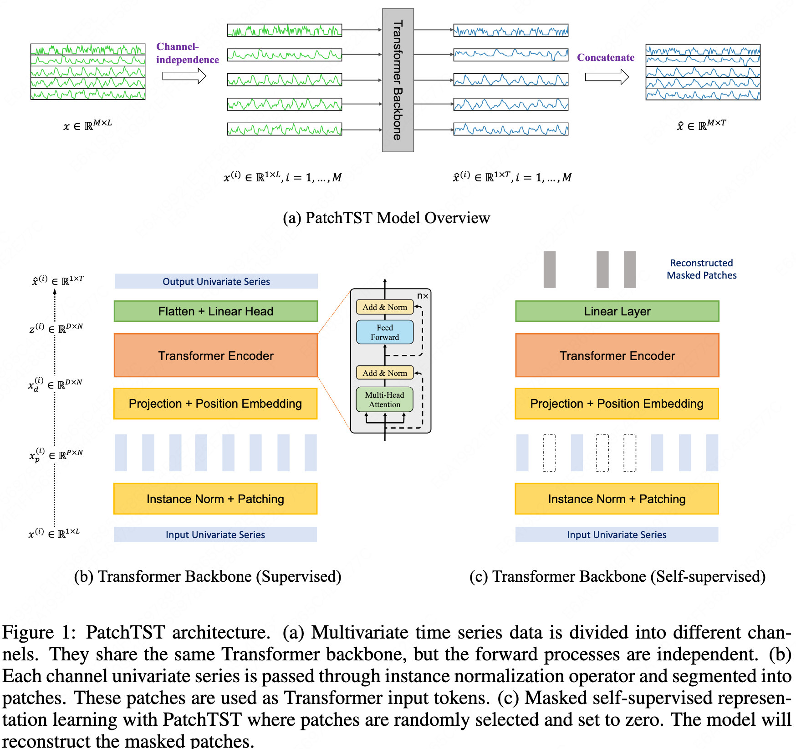
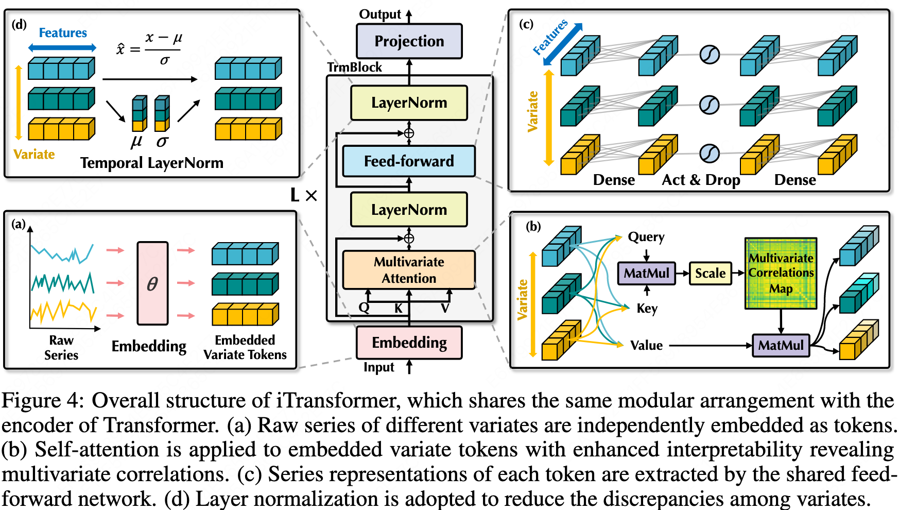
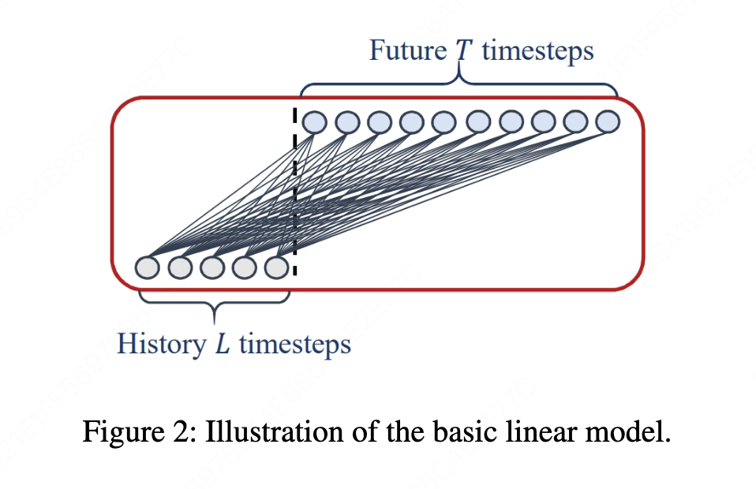

# Time Series Forecasting

## Machine Learning

### ARIMA (AutoRegressive Integrated Moving Average)

#### Abstract

<details markdown="1"><summary>chatgpt_arima</summary>

1. **Perform d-th order differencing on the original sequence**  
   Mathematically:
   $$
   y^{(d)}_t = \Delta^d x_t
   $$
   
   - For $d=1$: $y_t = x_t - x_{t-1}$
   - For $d=2$: $y_t = (x_t - x_{t-1}) - (x_{t-1} - x_{t-2})$

2. **Fit an ARMA(p, q) model to the differenced sequence**  

   $$
   y^{(d)}_t = \sum_{i=1}^{p} \phi_i y^{(d)}_{t-i} + \sum_{j=1}^{q} \theta_j \varepsilon_{t-j} + \varepsilon_t
   $$
   
   - $\phi_i$ : AR (AutoRegressive) parameters  
   - $\theta_j$ : MA (Moving Average) parameters  
   - $\varepsilon_t$ : residuals  

   Rearranging the formula gives:
   $$
   \varepsilon_t = y^{(d)}_t - \left(\sum_{i=1}^{p} \phi_i y^{(d)}_{t-i} + \sum_{j=1}^{q} \theta_j \varepsilon_{t-j}\right)
   $$
   
   We can compute all $\varepsilon_t$ by iterating over the sequence.

3. **Construct the likelihood using Gaussian noise and compute the negative log-likelihood**  
   Assume:
   
   $$
   \varepsilon_t \sim \mathcal{N}(0,\, \sigma^2)
   $$
   
   The log-likelihood for a single time step $t$ is:
   
   $$
   \log p(\varepsilon_t) = -\frac{1}{2} \left( \frac{\varepsilon_t^2}{\sigma^2} + \log(2\pi\sigma^2) \right)
   $$
   
   Set $\phi_i, \theta_j, \sigma$ as parameters, and optimize $\log p(\varepsilon_t)$.  

   > Note: Fitting the noise in this way is equivalent to Maximum Likelihood Estimation (MLE)

</details>

<br>

#### Paper

<br>

#### Tutorials

[时间序列模型(四)：ARIMA模型](https://zhuanlan.zhihu.com/p/634120397)

<br>

#### Code

<details><summary>chatgpt_arima</summary>

```python
import numpy as np
from scipy.optimize import minimize

class ARIMA:
    def __init__(self, p=1, d=0, q=0):
        self.p = p
        self.d = d
        self.q = q

    def difference(self, x, d):
        """执行 d 阶差分"""
        for _ in range(d):
            x = np.diff(x)
        return x

    def _neg_log_likelihood(self, params, y):
        """
        负对数似然：
        y_t = ar + ma + noise
        """
        p, q = self.p, self.q
        ar_params = params[:p]
        ma_params = params[p:p+q]
        sigma = params[-1]  # noise std
        print(f'ar_params:{ar_params}')
        print(f'ma_params:{ma_params}')
        print(f'sigma:{sigma}')

        T = len(y)
        eps = np.zeros(T)
        print(f'T:{T}')
        print(f'eps:{eps}')

        # ARIMA
        for t in range(max(p, q), T):
            ar_term = np.dot(ar_params, y[t-p:t][::-1])
            ma_term = np.dot(ma_params, eps[t-q:t][::-1])
            eps[t] = y[t] - ar_term - ma_term
            print(f't:{t}')
            print(f'y[t-p:t][::-1]:{y[t-p:t][::-1]}')
            print(f'eps[t-q:t][::-1]:{eps[t-q:t][::-1]}')
            print(f'ar_term:{ar_term}')
            print(f'ma_term:{ma_term}')
            print(f'eps[{t}]:{eps[t]}')
            exit()
            


        ll = -0.5 * np.sum((eps / sigma)**2 + np.log(2*np.pi*sigma**2))
        return -ll  # minimize negative log likelihood

    def fit(self, x):
        y = self.difference(x, self.d)
        print(f'y:{y}')
        print(f'y.shape:{y.shape}')

        init_params = np.random.randn(self.p + self.q + 1)
        print(f'init_params:{init_params}')


        result = minimize(self._neg_log_likelihood, init_params, args=(y,))
        self.params = result.x
        return self

    def predict(self, x, steps=1):

        p, d = self.p, self.d
        y = self.difference(x, d)
        ar_params = self.params[:p]

        preds = []
        cur = y.copy()

        for _ in range(steps):

            pred = np.dot(ar_params, cur[-p:][::-1])
            cur = np.append(cur, pred)
            preds.append(pred)


        for _ in range(d):
            preds = np.cumsum(np.r_[x[-1], preds])[1:]

        return preds

import numpy as np
import matplotlib.pyplot as plt


np.random.seed(0)
x = np.cumsum(np.random.randn(200))  
print(f'x:{x}')

model = ARIMA(p=2, d=1, q=1)
model.fit(x)

pred = model.predict(x, steps=20)

plt.plot(range(len(x)), x, label="data")
plt.plot(range(len(x), len(x)+20), pred, label="forecast")
plt.legend()
plt.show()
```

</details>

<br>

---

### XGBoost

#### Abstract

<br>

#### Paper

[XGBoost: A Scalable Tree Boosting System](https://www.kdd.org/kdd2016/papers/files/rfp0697-chenAemb.pdf)

KDD 2016 Cited 68032

<br>

#### Tutorials
[超详细解析XGBoost（你想要的都有）](https://zhuanlan.zhihu.com/p/562983875)

<br>

#### Code

<details><summary>chatgpt_arima</summary>

```python
import numpy as np
import pandas as pd
from sklearn.linear_model import Lasso
import matplotlib.pyplot as plt

class MiniProphet:
    def __init__(self, n_changepoints=10, yearly_order=5, holidays=None, changepoint_penalty=0.1):
        self.n_changepoints = n_changepoints
        self.yearly_order = yearly_order
        self.holidays = holidays
        self.changepoint_penalty = changepoint_penalty

    def _make_changepoints(self, t):
        # 均匀选 changepoints
        cp_index = np.linspace(0, len(t)-1, self.n_changepoints+2)[1:-1].astype(int)
        return t[cp_index]

    def _design_matrix(self, df):
        t = df['t'].values
        
        # 1) 基础线性趋势: k*t + m
        X = [t, np.ones_like(t)]
        # print(f'X:{X}')
        
        # 2) 趋势改变点：ReLU(t - s)
        for s in self.changepoints:
            X.append(np.maximum(0, t - s))
        
        # print(f'self.changepoints:{self.changepoints}')
        # print(f'X:{X}')
        
        # 3) yearly seasonality (Fourier)
        for i in range(1, self.yearly_order + 1):
            X.append(np.sin(2 * np.pi * i * df['t_year'].values))
            X.append(np.cos(2 * np.pi * i * df['t_year'].values))
        
        # print(f'self.yearly_order:{self.yearly_order}')
        # print(f'X:{X}')
        
        # 4) holidays
        if self.holidays is not None:
            for h in self.holidays:
                X.append((df['date'] == h).astype(float).values)
        # print(f'self.holidays:{self.holidays}')
        # print(f'X:{X}')
        exit()
        
        X = np.vstack(X).T  # [n_samples, n_features]
        return X

    def fit(self, df):
        df = df.copy()
        df['date'] = pd.to_datetime(df['ds'])
        
        # 标准化时间 (t ∈ [0,1])
        df['t'] = (df['date'] - df['date'].min()).dt.days.astype(float)
        df['t'] /= df['t'].max()
        
        # yearly position
        df['t_year'] = df['date'].dt.dayofyear / 365.25
        print(f'df:{df}')

        # choose changepoints
        self.changepoints = self._make_changepoints(df['t'].values)
        print(f'changepoints:{self.changepoints}')
        
        # Build design matrix
        X = self._design_matrix(df)
        y = df['y'].values
        
        # Fit with L1 penalty on changepoints → selects only some changepoints
        model = Lasso(alpha=self.changepoint_penalty, fit_intercept=False)
        model.fit(X, y)
        
        self.model = model
        self.features = X.shape[1]
        return self

    def predict(self, future_df):
        df = future_df.copy()
        df['date'] = pd.to_datetime(df['ds'])
        
        df['t'] = (df['date'] - self.date_min).dt.days.astype(float)
        df['t'] /= self.t_scale
        
        df['t_year'] = df['date'].dt.dayofyear / 365.25
        
        X = self._design_matrix(df)
        yhat = self.model.predict(X)
        return yhat

df = pd.DataFrame({
    'ds': pd.date_range('2022-01-01', periods=365),
    'y': np.sin(np.linspace(0, 8*np.pi, 365)) + np.linspace(0, 1, 365)
})
print(f'df:{df}')
# # 绘制y
# plt.plot(df['ds'], df['y'])
# plt.show()

m = MiniProphet(
    n_changepoints=8,
    yearly_order=5,
    holidays=['2022-02-01', '2022-10-01'],  # 举例
    changepoint_penalty=0.1
)

m.fit(df)

future = pd.DataFrame({'ds': pd.date_range('2022-01-01', periods=400)})
yhat = m.predict(future)
```

</details>

---

### Prophet
#### Abstract

<details><summary>Prophet Abstract</summary>

1. Formula:
   It is based on additive model:

   $$
   y(t) = g(t) + s(t) + h(t) + \varepsilon_t
   $$

   Where:

   $g(t)$ — Trend
   
   $s(t)$ — Seasonality (yearly / weekly / daily, etc.)
   
   $h(t)$ — Holiday effects
   
   $\varepsilon_t$ — Noise
   
   Each component can be modeled using different methods.
   
2. Data
   It is a local model, built on a single time series.
   
   The inputs include only the timestamps and the corresponding time series.
   
   It can be seen as performing a series of feature engineering steps on the time variable: transform the time into various representations, transpose the data so that each timestamp becomes a row, and treat the time-based transformations as features. 
   
   Then it applies Lasso or Ridge regression for modeling.

   $$
   X_t = [t, t^2, \sin(2 \pi t / 365), \cos( 2 \pi t /365), 1_{holiday}, ....]
   $$

   $$
   y_t = \text{observed value at time t}
   $$

</details>

<br>

#### Paper

<br>

#### Tutorials

<br>

#### Code

<details><summary>chatgpt_prophet</summary>

```python
import numpy as np
import pandas as pd
from sklearn.linear_model import Lasso
import matplotlib.pyplot as plt

class MiniProphet:
    def __init__(self, n_changepoints=10, yearly_order=5, holidays=None, changepoint_penalty=0.1):
        self.n_changepoints = n_changepoints
        self.yearly_order = yearly_order
        self.holidays = holidays
        self.changepoint_penalty = changepoint_penalty

    def _make_changepoints(self, t):
        # 均匀选 changepoints
        cp_index = np.linspace(0, len(t)-1, self.n_changepoints+2)[1:-1].astype(int)
        return t[cp_index]

    def _design_matrix(self, df):
        t = df['t'].values
        
        # 1) 基础线性趋势: k*t + m
        X = [t, np.ones_like(t)]
        # print(f'X:{X}')
        
        # 2) 趋势改变点：ReLU(t - s)
        for s in self.changepoints:
            X.append(np.maximum(0, t - s))
        
        # print(f'self.changepoints:{self.changepoints}')
        # print(f'X:{X}')
        
        # 3) yearly seasonality (Fourier)
        for i in range(1, self.yearly_order + 1):
            X.append(np.sin(2 * np.pi * i * df['t_year'].values))
            X.append(np.cos(2 * np.pi * i * df['t_year'].values))
        
        # print(f'self.yearly_order:{self.yearly_order}')
        # print(f'X:{X}')
        
        # 4) holidays
        if self.holidays is not None:
            for h in self.holidays:
                X.append((df['date'] == h).astype(float).values)
        # print(f'self.holidays:{self.holidays}')
        # print(f'X:{X}')
        exit()
        
        X = np.vstack(X).T  # [n_samples, n_features]
        return X

    def fit(self, df):
        df = df.copy()
        df['date'] = pd.to_datetime(df['ds'])
        
        # 标准化时间 (t ∈ [0,1])
        df['t'] = (df['date'] - df['date'].min()).dt.days.astype(float)
        df['t'] /= df['t'].max()
        
        # yearly position
        df['t_year'] = df['date'].dt.dayofyear / 365.25
        print(f'df:{df}')

        # choose changepoints
        self.changepoints = self._make_changepoints(df['t'].values)
        print(f'changepoints:{self.changepoints}')
        
        # Build design matrix
        X = self._design_matrix(df)
        y = df['y'].values
        
        # Fit with L1 penalty on changepoints → selects only some changepoints
        model = Lasso(alpha=self.changepoint_penalty, fit_intercept=False)
        model.fit(X, y)
        
        self.model = model
        self.features = X.shape[1]
        return self

    def predict(self, future_df):
        df = future_df.copy()
        df['date'] = pd.to_datetime(df['ds'])
        
        df['t'] = (df['date'] - self.date_min).dt.days.astype(float)
        df['t'] /= self.t_scale
        
        df['t_year'] = df['date'].dt.dayofyear / 365.25
        
        X = self._design_matrix(df)
        yhat = self.model.predict(X)
        return yhat

df = pd.DataFrame({
    'ds': pd.date_range('2022-01-01', periods=365),
    'y': np.sin(np.linspace(0, 8*np.pi, 365)) + np.linspace(0, 1, 365)
})
print(f'df:{df}')
# # 绘制y
# plt.plot(df['ds'], df['y'])
# plt.show()

m = MiniProphet(
    n_changepoints=8,
    yearly_order=5,
    holidays=['2022-02-01', '2022-10-01'],  # 举例
    changepoint_penalty=0.1
)

m.fit(df)

future = pd.DataFrame({'ds': pd.date_range('2022-01-01', periods=400)})
yhat = m.predict(future)


```
   
</details>

<br>

---

## Deep Learning

### TCN

#### Abstract

<br>

#### Paper

[An Empirical Evaluation of Generic Convolutional and Recurrent Networks for Sequence Modeling](https://arxiv.org/abs/1803.01271)

arXiv 2018 Cited by 7490

<br>

#### Tutorials

<br>

#### Code
[TCN](https://github.com/locuslab/TCN)

<br>

---

### N-BEATS

#### Abstract

<br>

#### Paper

[N-BEATS: Neural basis expansion analysis for interpretable time series forecasting](https://arxiv.org/abs/1905.10437)

ICLR 2019 Cited by 1691

<br>

#### Tutorials

<br>

#### Code

[pytorch-forecasting](https://github.com/sktime/pytorch-forecasting/tree/main)

[N-BEATS](https://github.com/ServiceNow/N-BEATS/tree/master)

<br>

---

### NHITS

#### Abstract

<br>

#### Paper

[NHITS: Neural Hierarchical Interpolation for Time Series Forecasting](https://ojs.aaai.org/index.php/AAAI/article/view/25854)

AAAI 2023 Cited by 621

<br>

#### Tutorials

<br>

#### Code

<br>

---

### TimesNet

#### Abstract

<br>

#### Paper

[TimesNet: Temporal 2D-Variation Modeling for General Time Series Analysis](https://arxiv.org/abs/2210.02186)

ICLR 2023 Cited by 1529

#### Tutorials

<br>

#### Code

<br>

---

### RNN-based

#### LSTM

#### Abstract

<details><summary>LSTM Abstract</summary>

1. Overall, LSTM has three gates: the forget gate f, the input (memory) gate i, and the output gate o, corresponding respectively to c, [x, h], along with the new c (the new cell state is obtained by combining the previous two).
   
   The cell state c stores long-term information, h is essentially the previous output, and x is the current input.

2. LSTM input shape:
   [batch_size, seq_len, feature_num]

   LSTM output shape:
   [batch_size, seq_len, out_dim]

   Hidden state h:
   [1, batch_size, out_dim]

   Cell state c:
   [1, batch_size, out_dim]

3. It’s not broadcasting; it’s a loop. An LSTM is internally implemented as a loop that processes each time step individually. It splits the input along the second dimension so that each position’s time-step x is handled separately. At every time step, the LSTM module operations are performed, producing h and c for the next step.
   
   ❗️PyTorch’s LSTM hides this looping mechanism.

4. nn.LSTM specifies the input dimension and the hidden dimension. The final output includes only the hidden state h and cell state c from the last time step. Therefore, the hidden dimension and output dimension match.
   
   Even though intermediate steps temporarily increase dimensionality when concatenating h and x, the weight matrices always project it back into the hidden dimension.

5. The final output is essentially all the h values concatenated along the second dimension.


   
</details>

<br>

#### Paper

<br>

#### Tutorials

[人人都能看懂的LSTM](https://zhuanlan.zhihu.com/p/32085405)

<br>

#### Code

<br>

---

### Seq2seq

#### Abstract

<br>

#### Paper

[Sequence to sequence learning with neural networks](https://proceedings.neurips.cc/paper_files/paper/2014/file/5a18e133cbf9f257297f410bb7eca942-Paper.pdf)

NeurIPS 2014 Cited by 28288

<br>

#### Tutorials

<br>

#### Code

<br>

---

### MQRNN

#### Abstract

<br>

#### Paper

[A Multi-Horizon Quantile Recurrent Forecaster](https://arxiv.org/abs/1711.11053)

NeurIPS 2017 Cited by 608

<br>

#### Tutorials

<br>

#### Code

<br>

---

### LSTNet

#### Abstract

<br>

#### Paper

[Modeling Long- and Short-Term Temporal Patterns with Deep Neural Networks](https://dl.acm.org/doi/abs/10.1145/3209978.3210006)

SIGIR 2018 Cited by 2573

<br>

#### Tutorials

<br>

#### Code

[LSTNet](https://github.com/laiguokun/LSTNet?tab=readme-ov-file)

<br>

---

### DeepAR (Deep Autoregressive)
#### Abstract

<details><summary>DeepAR Abstract</summary>

1. Using an LSTM as the basic module, with initial $c$ and $h$ set to 0. The input contains covariates  $x$ and the previous step’s $z$ and 
$h$.
2. The model’s final outputs are $μ$ and $σ$, which are the two parameters of the distribution rather than the actual prediction value. The actual prediction must be obtained by sampling from the distribution defined by $μ$ and $σ$.
   
   $$
   \begin{aligned}
   p_G(z \mid \mu, \sigma) &= (2 \pi \sigma^2)^{-1/2} \exp (-(z - \mu)^2 / (2 \sigma^2)), \\
   \mu(h_{i,t}) &= w_{\mu}^T h_{i,t} + b_{\mu}, \\ 
   \sigma(h_{i,t}) &= \log (1 + \exp(w_{\sigma}^T h_{i,t} +b_{\sigma}))
   \end{aligned}
   $$
3. The model is trained using the log-likelihood as the loss function. The $p$ corresponds to the distribution determined by $μ$ and $σ$, and $z$ is the ground truth.
   
   $$
   L = \sum_{i=1}^N \sum_{t=t_0}^{T} \log p(z_{i,t} \mid \theta (h_i,t))

   $$
4. In essence, prediction involves sampling from the distribution, while training uses the true value to compute the likelihood and infer the distribution parameters. During training, each time step of every sequence outputs a $μ$ and $σ$, and prediction works the same way.
5. During training, the model uses the true $z_{i,t-1}$ to predict $z_{i,t}$. However, during inference it uses the previously predicted $z_{i,t-1}$. The paper acknowledges this issue but claims it does not observe an impact. Still, this is clearly questionable. In the terminology of lstm_linear, this is essentially an IMS (Iterated Multi-Step) model



</details>

<br>

#### Paper

[DeepAR: Probabilistic forecasting with autoregressive recurrent networks](https://www.sciencedirect.com/science/article/pii/S0169207019301888)

International Journal of Forecasting 2020 Cited by 2524

<br>

#### Tutorials

<br>

#### Code

[pytorch-forecasting](https://github.com/sktime/pytorch-forecasting/tree/main)

[DeepAR-pytorch](https://github.com/husnejahan/DeepAR-pytorch)

<br>

---

## Transformer-based
### LogTrans/Time-Series Transformer
#### Abstract

<br>

#### Paper

[Enhancing the Locality and Breaking the Memory Bottleneck of Transformer on Time Series Forecasting](https://proceedings.neurips.cc/paper/2019/hash/6775a0635c302542da2c32aa19d86be0-Abstract.html)

NeurIPS 2019 Cited by 2045

<br>

#### Tutorials

<br>

#### Code

<br>

---

### Longformer
#### Abstract

<br>

#### Paper

[Longformer: The Long-Document Transformer](https://arxiv.org/abs/2004.05150)

arXiv 2020 Cited by 4690

<br>

#### Tutorials

<br>

#### Code

<br>

---

### Reformer
#### Abstract

<br>

#### Paper

[Reformer: The Efficient Transformer](https://arxiv.org/abs/2001.04451)

ICLR 2020 Cited by 3152

<br>

#### Tutorials

<br>

#### Code

<br>

---

### Informer
#### Abstract

<details><summary>Informer Abstract</summary>

The paper proposes an improved variant of the original Transformer model, with three main modifications:

1. ProbSparse Attention: By comparing the attention distribution with a uniform distribution, the model reduces the time and space complexity of the attention mechanism from $O(L^2)$ to $O(L \ln L)$, where $L$ is the sequence length.

2. Self-attention Distillation: By inserting max-pooling layers between attention modules, the model further reduces memory usage.

3. Generative Inference: Instead of autoregressively generating predictions one token at a time, the model directly predicts the entire sequence in one step.

The final model outperforms LSTM, Reformer, and several other baselines.

</details>

<br>

#### Paper

[Informer: Beyond Efficient Transformer for Long Sequence Time-Series Forecasting](https://ojs.aaai.org/index.php/AAAI/article/view/17325)

AAAI 2021 Cited by 4838

<br>

#### Tutorials

<br>

#### Code

[Informer2020](https://github.com/zhouhaoyi/Informer2020)

<br>

---

### Autoformer
#### Abstract

<details><summary>Autoformer Abstract</summary>

1. Auto-correlation:
   The attention mechanism is applied After the sliding operation and Fourier decomposition in frequency domain. 
   Only the top $logL$ sliding attention scores are selected.
   $$
   \begin{aligned}
   S_{xx}(f) &= F(X_t) F^*(X_t) = \int_{-\infty}^{\infty} X_t   e^{-i 2 \pi t f} dt \overline{\int_{-\infty}^{\infty} X_t   e^{-i 2 \pi t f} dt} \\

   R_{xx}(\tau) &= F^{-1}(S_{xx}(f)) = \int_{-\infty}   {\infty} S_{xx}(f) e^{i 2 \pi f \tau} df
   \end{aligned}
   $$

   $$
   \tau_1, ..., \tau_k = \arg_{\tau \in (1, ..., L)} \text   {Topk} (R_{Q,K}(\tau)) \\
   \hat{R}_{Q,K}(\tau_1), ..., \hat{R}_{Q,K}(\tau_k) = \text   {SoftMax} (R_{Q,K} (\tau_1), ..., R_{Q,K} (\tau_k)) \\
   \text{Auto-Correlation}(Q,K,V) = \sum_{i=1}^k \text{Roll}   (V, \tau_i) \hat{R}_{Q,K} (\tau_i)
   $$

2. Serires decomposition:
   
   $$
   X_t = \text{Avgpool(\text{Padding(X)})} \\
   X_s = X - X_t
   $$

3. Input
   The encoder input is vector of sequence length. 
   
   The decoder input is vector of label length plus some zeros, or the average of the input part.

4. Positional encoding
   
   [Transformer中Position Embedding的原理与思考](https://allenwind.github.io/blog/11574/)

   Cannot distinguish the order of relations?
   
   [Transformer学习笔记一：Positional Encoding（位置编码）](https://zhuanlan.zhihu.com/p/454482273)

5. Token Embedding
   A 1D convolution is used instead of a linear layer. 
   
   This captures the relationships between adjacent time points, which is equivalent to applying convolution kernels along the time dimension (the second-to-last dimension), while transforming the feature dimension (the last dimension) to the d_model dimension. 
   
   This step is essentially a CNN.

   Convolution layer parameter count: The parameter count for each convolution kernel is the kernel size multiplied by the number of input channels. The number of convolution kernels equals the number of output channels. (Clearly, different convolution kernels for different channels should be used.)
   
   If bias is considered, then an additional vector of the length equal to the number of output channels is added.
   
   Fully connected layer parameter count is the size of the weight matrix, which is the number of input channels multiplied by the number of output channels. 
   
   If bias is considered, an additional vector of length equal to the number of output channels is added.
   
   In this scenario, the convolution is equivalent to each feature channel multiplying and summing with the convolution kernel, and the final sum results in a value. There are d_model such convolution kernels.
   
   This process first integrates features across local time dimensions at the feature level, then adds across features, finally generating internal features in multiple dimensions.
   
   This seems quite reasonable.

6. Additionally, there is a Temporal Embedding.
   
   Positional encoding using sine and cosine functions on the monthly, weekly, daily, and minute dimensions.
   
   Each dimension is assigned a specific sequence length, and these are summed together. This is impressive!
   
   The source code seems to set different sequence lengths based on the dataset, which should be modified. Originally, it assumed data was gathered every 15 minutes.

7. FFT
   The complexity of formulas 6 and 7 is $O(L \log L)$ because the top $L \log L$ sequences are selected, whereas formula 5 is not, and it has $O(L^2)$. By using the FFT in formula 8, with its recursive properties, it can achieve $O(L \log L)$.
   
   The FFT result is used as a weight to multiply the input sequence, rolling the corresponding time intervals of the sequence.
   
   This is equivalent to transforming the previous input to get the output?
   
   It still seems to go against the original purpose of the Transformer. It's like blending words that can only appear in the same sentence as previous words?
   
   The FFT here is applied only to the sequence dimension, while the process for each feature dimension is completely independent.
   
   Multi-head attention in the Auto-correlation part is actually exactly the same; only the FeedForward layer right after has feature interactions between layers.




</details>

<br>

#### Paper

[Autoformer: Decomposition Transformers with Auto-Correlation for Long-Term Series Forecasting](https://proceedings.neurips.cc/paper/2021/hash/bcc0d400288793e8bdcd7c19a8ac0c2b-Abstract.html)

NeurIPS 2021 Cited by 2438

<br>

#### Tutorials

<br>

#### Code

<br>

---

### TFT (Temporal Fusion Transformers)
#### Abstract

<details><summary>TFT Abstract</summary>

1. It is compared with the LogTrans, DeepAR and MQRNN. It is an attention-based DNN architecture and is almost unrelated to the classical Transformer in terms of structure.
2. In terms of data structure, the model considers that many variables are not known at prediction time, such as historical customer traffic.
3. Gating mechanism:
   to introduce nonlinear relationships only where needed.
   $$
   GRN_w(a,c) = \text{LayerNorm} (a + GLU_w ( \eta_1)) \\
   \eta_1 = W_{1,w} \eta_2 + b_{1,w} \\
   \eta_2 = ELU(W_{2,w} a + W_{3,w} c + b_{2,w}) \\
   GLU_w(\gamma) = \sigma(W_4,w \gamma + b_{4,w}) \bigodot (W_{5,w} \gamma + b_{5,w})
   $$
4. Variable selection:
   $$
   v_{X_t} = Softmax(GRN_{v_X} (\Xi_t, c_s)) \\
   \hat{\xi}_t^{(j)} = GRN_{\hat{\xi}(j)} (\xi_t^{(j)}) \\
   \hat{\xi}_t = \sum_{j=1}^{m_X} v_{X_t}^{(j)} \hat{\xi}_t^{(j)}
   $$

5. Interpretable Muti-head Attention:
   $$
   \begin{aligned}
   \hat{H} &= \hat{A} \, (Q, \, K)V \, W_V \\
   &= \left\{\frac{1}{m_H} \sum_{h=1}^{m_H} A (Q W_Q^{(h)}, K W_K^{(h)}) \right\} V W_V, \\
   &= \frac{1}{m_H} \sum_{h=1}^{m_H} \text{Attention} (Q W_Q^{(h)}, K W_K^{(h)}, V W_V)
   \end{aligned}
   $$

6. Quantile prediction
   
7. Loss function:
   $$
   L(\Omega, W) = \sum_{y_t \in \Omega} \sum_{q \in Q} \sum_{\tau=1}^{\tau_{max}} \frac{QL(y_t, \hat{y} (q, t- \tau, \tau), q)}{M \tau_{max}} \\
   QL(y, \hat{y}, q) = q ( y - \hat{y})_+ + (1 - q)(\hat{y} - y)_+
   $$

8. Both PyTorch Forecasting and Kaggle did not properly separate the validation set.
   
   Using the test set for Optuna hyperparameter tuning obviously leads to data leakage.



</details>

<br>

#### Paper

[Temporal Fusion Transformers for interpretable multi-horizon time series forecasting](https://www.sciencedirect.com/science/article/pii/S0169207021000637)

International Journal of Forecasting 2021 Cited by 1835

<br>

#### Tutorials

[Demand forecasting with the Temporal Fusion Transformer](https://pytorch-forecasting.readthedocs.io/en/latest/tutorials/stallion.html)

[【时序】TFT：Temporal Fusion Transformers](https://zhuanlan.zhihu.com/p/514287527)

[Pytorch Forecasting => TemporalFusionTransformer](https://www.kaggle.com/code/luisblanche/pytorch-forecasting-temporalfusiontransformer/notebook)

[Store Sales - Time Series Forecasting](https://www.kaggle.com/competitions/store-sales-time-series-forecasting/data)

[Volume Forecasting](https://www.kaggle.com/datasets/utathya/future-volume-prediction/data)

<br>

#### Code

[google-research](https://github.com/google-research/google-research/tree/master/tft)

[tft_tf2](https://github.com/greatwhiz/tft_tf2)

[pytorch-forecasting](https://github.com/sktime/pytorch-forecasting/tree/main)

<br>

---

### Fedformer
#### Abstract

<details><summary>Fedformer Abstract</summary>

1. It can be considered an upgraded version of Autoformer. The overall architecture is consistent with Autoformer, but many details and sub-modules differ. The results are also compared directly against Autoformer.

2. Wavelet transform is added on top of the Fourier transform.

3. The top-k selection is replaced by random selection, and it is applied before the $q_k$ multiplication.

4. A MoE (Mixture of Experts) mechanism is added to the frequency-domain decomposition.
   
   $$
   X_{trend} = Softmax(L(x)) * (F(x))
   $$

5. The related work section of this paper is extremely comprehensive and very well organized.




</details>

<br>

#### Paper

[FEDformer: Frequency Enhanced Decomposed Transformer for Long-term Series Forecasting](https://proceedings.mlr.press/v162/zhou22g)

PMLR 2022 Cited by 1960

<br>

#### Tutorials

<br>

#### Code

[ICML2022-FEDformer](https://github.com/DAMO-DI-ML/ICML2022-FEDformer)

<br>

---

### Pyraformer
#### Abstract

<br>

#### Paper

[Pyraformer: Low-Complexity Pyramidal Attention for Long-Range Time Series Modeling and Forecasting](https://repositum.tuwien.at/handle/20.500.12708/135874)

ICLR 2022 Cited by 934

<br>

#### Tutorials

<br>

#### Code

<br>

---

### PatchTST
#### Abstract

<details><summary>PatchTST Abstract</summary>

1. Patching 
   
   The sequence is truncated into patches and then transposed so that each patch becomes a single token.

2. Channel independence
   
   Each variable’s time series is fed into the Transformer independently, without interacting with other variables.

3. Normalization
   
   This is instance normalization, which is fine — it does not mix information across different features.

4. Linear layer
   
   A single weight matrix is applied to all (batch_size, n_variables, patch_num), transforming the dimension from patch_len to d_model.
   
   Although instance normalization is applied, giving each feature the same influence is clearly unreasonable, and there is no interaction between features.
   
   Therefore, this should not be considered a linear layer but rather an embedding layer.

5. Attention layer 
   
   Positional encoding addition: PyTorch’s broadcasting mechanism aligns dimensions from right to left when adding positional encodings.

   Encoder input: batch_size and n_vars are merged into a single dimension before being passed into the encoder, which is consistent with the channel-independent design.
   
   Multi-head attention: The view operation reorganizes dimensions from right to left, splitting the last dimension first.
   
   QK multiplication: matmul multiplies the last two dimensions; d_k disappears as the inner dimension.
   
   The resulting attention weights/scores have shape (q_len, q_len).
   
   Thus, different features are treated equally.The attention weights represent the correlations between patches at different positions, and there are linear layers with d_model dimensions both before and after.
   


</details>

<br>

#### Paper

[A Time Series is Worth 64 Words: Long-term Forecasting with Transformers](https://arxiv.org/abs/2211.14730)

ICLR 2023 Cited by 1390

<br>

#### Tutorials

<br>

#### Code

[PatchTST](https://github.com/yuqinie98/PatchTST)

<br>

---

### Crossformer
#### Abstract

<br>

#### Paper

[Crossformer: Transformer Utilizing Cross-Dimension Dependency for Multivariate Time Series Forecasting](https://openreview.net/forum?id=vSVLM2j9eie)

ICLR 2023 Cited by 937

<br>

#### Tutorials

<br>

#### Code

<br>

---

### iTransformer
#### Abstract

<details><summary>iTransformer Abstract</summary>

1. Inverted:
   Embedding the whole series as the token.
2. It is a framework and a bundle of efficient attention mechanisms can be the plugins.
   


<br>

</details>

#### Paper

[iTransformer: Inverted Transformers Are Effective for Time Series Forecasting](https://arxiv.org/abs/2310.06625)

ICLR 2024 Cited by 659

<br>

#### Tutorials

<br>

#### Code

[iTransformer](https://github.com/thuml/iTransformer)

<br>

---

### PDF
#### Abstract

<br>

#### Paper

[Periodicity Decoupling Framework for Long-term Series Forecasting](https://openreview.net/forum?id=dp27P5HBBt)

ICLR 2024 Cited by 35

<br>

#### Tutorials

<br>

#### Code

[PDF](https://github.com/Hank0626/PDF?tab=readme-ov-file)

<br>

---

### DUET
#### Abstract

<br>

#### Paper

[DUET: Dual Clustering Enhanced Multivariate Time Series Forecasting](https://arxiv.org/abs/2412.10859)

KDD 2025 Cited by 8

<br>

#### Tutorials

<br>

#### Code

[Duet](https://github.com/decisionintelligence/DUET)

<br>

---

## LLMs-based

### One fits all
#### Abstract

<br>

#### Paper

[One Fits All: Power General Time Series Analysis by Pretrained LM](https://proceedings.neurips.cc/paper_files/paper/2023/hash/86c17de05579cde52025f9984e6e2ebb-Abstract-Conference.html)  

NeurIPS 2023 Cited by 508

<br>

#### Tutorials

<br>

#### Code

[NeurIPS2023-One-Fits-All](https://github.com/DAMO-DI-ML/NeurIPS2023-One-Fits-All)

<br>

---

### TimeGPT
#### Abstract

<br>

#### Paper

[TimeGPT-1](https://arxiv.org/abs/2310.03589)  
arXiv 2023 Cited by 289

<br>

#### Tutorials

<br>

#### Code

[Nixtla / TimeGPT](https://github.com/Nixtla/nixtla)

<br>

---

### TimesFM
#### Abstract

<br>

#### Paper

[TimesFM](https://openreview.net/forum?id=jn2iTJas6h)  

ICML 2024 Cited by 392

<br>

#### Tutorials

<br>

#### Code

[Google Research / TimesFM](https://github.com/google-research/timesfm?tab=readme-ov-file)

<br>

---

### Chronos
#### Abstract

<br>

#### Paper

[Chronos](https://arxiv.org/abs/2403.07815)  

arXiv 2024 Cited by 417

<br>

#### Tutorials

<br>

#### Code

[Amazon Science / Chronos](https://github.com/amazon-science/chronos-forecasting)

<br>

---

### Time-LLM
#### Abstract

<br>

#### Paper

[Time-LLM](https://arxiv.org/abs/2310.01728)  

ICLR 2024 Cited by 797

<br>

#### Tutorials

<br>

#### Code

[KimMeen / Time-LLM](https://github.com/KimMeen/Time-LLM)

<br>

---

### CALF
#### Abstract

<br>

#### Paper

[CALF](https://ojs.aaai.org/index.php/AAAI/article/view/34082)  

AAAI 2025 Cited by 21

<br>

#### Tutorials

<br>

#### Code

<br>

---

### LLM4TS
#### Abstract

<br>

#### Paper

[LLM4TS](https://openreview.net/forum?id=6MKvV3bpfk)  

TIST 2025 Cited by 158

<br>

#### Tutorials

<br>

#### Code

[blacksnail789521 / LLM4TS](https://github.com/blacksnail789521/LLM4TS)

<br>

---

## Leadboard

### TFB

#### Abstract

<br>

#### Paper

[TFB: Towards Comprehensive and Fair Benchmarking of Time Series Forecasting Methods](https://arxiv.org/abs/2403.20150)

PVLDB 2024 Cited by 46

<br>

#### Tutorials

<br>

#### Code

[decisionintelligence / TFB](https://github.com/decisionintelligence/TFB)

<br>

---

### Time-Series-Library

#### Abstract

<br>

#### Paper

<br>

#### Tutorials

<br>

#### Code

[thuml / Time-Series-Library](https://github.com/thuml/Time-Series-Library)

<br>

---

## Review

### LTSF-Linear

#### Abstract

<details><summary>LTSF-Linear Abstract</summary>

Linear layers are  channel-independent

It maps the input sequence length to the output sequence length instead of mapping input channels to output channels.



1. DLinear and NLinear feel like they are imitating ARIMA, and they’re even less sophisticated—after all, the former two don’t combine their components the way ARIMA does. So why were earlier models stronger than ARIMA, yet weaker than these two models? Is it because of the difference between DMS and IMS?

2. For exchange-rate time-series forecasting, machine learning performs worse than simply repeating the last value. This suggests that, to some extent, predicting exchange rates from historical data is not very meaningful—machine-learning models just overfit. Conceptually, this might be because exchange rates are the result of strategic interactions (a game-theoretic equilibrium).

3. This “qualitative result” figure makes it look like the authors didn’t train those transformer networks properly.

4. Indeed, almost every previous paper mentions that the scenario is LTSF, which probably aligns with the fact that transformers were originally designed to deal with the vanishing-gradient problem of RNNs and to learn long sequences.

5. We definitely need to include cabinet or store identifiers; something channel-independent like Linear would absolutely be wrong❗️
   
   The linear layer in NLinear operates on the temporal dimension, while the channel dimension effectively stays in a fixed order.
   
   But the issue is that here the “channels” are equivalent to the batch dimension, so everything gets averaged as if they were the same sample.
   
   So we can only say the data are independent, but the processing is completely identical—it’s all using the same weight matrix.

</details>

<br>

#### Paper

[Are Transformers Effective for Time Series Forecasting?](https://ojs.aaai.org/index.php/AAAI/article/view/26317)

AAAI 2023 Cited by 2310

<br>

#### Tutorials

<br>

#### Code

[LTSF-Linear](https://github.com/cure-lab/LTSF-Linear)

<br>

---

### LLMsForTimeSeries
#### Abstract

<br>

#### Paper

[LLMsForTimeSeries](https://proceedings.neurips.cc/paper_files/paper/2024/hash/6ed5bf446f59e2c6646d23058c86424b-Abstract-Conference.html)  

NeurIPS 2024 Cited by 84

<br>

#### Tutorials

<br>

#### Code

[BennyTMT / LLMsForTimeSeries](https://github.com/BennyTMT/LLMsForTimeSeries)

<br>

---

### Bergmeir NeurIPS Talk

#### Abstract

<details><summary>Bergmeir NeurIPS Talk Abstract</summary>

1. "Qiu et al. (PVLDB, 2024): PatchTST evaluates using a 'Drop Last trick'",
the mentioned paper corresponds to the TFB paper.

2. It presents solid criticisms of many Transformer- and LLM-based time-series forecasting papers, and reaffirms the value of traditional models such as N-BEATS and DHR-ARIMA. It also recommends several newly released models, such as Chronos, TimeGPT, and TimesFM, but it’s unclear what distinguishes these recommended new models from one another.

3. Regarding datasets, it basically recommends only M4 and Monash, while raising concerns about the others.

4. This is especially true for economics-related datasets such as stock prices and exchange rates, since markets tend to be efficient and offer no exploitable additional information for forecasting. For weather-related datasets such as electricity demand, experts generally believe forecasting more than two weeks ahead is unrealistic.

5. It even questions the very existence or justification of global models / foundation models (where the dataset contains multiple time series; local models use only a single series). If many unrelated features are all used together as part of the loss function, they can negatively impact the model’s performance on the target domain/features. ❗️

6. Corresponding to the ambiguity of language models, time-series models also need clarification. But the problem is: humans themselves might not know these clarifications. Are we supposed to turn time-series models into something like a chatbot that experts can interact with, continuously supplying contextual information? ❓
   
</details>

<br>

#### Paper

[Fundamental limitations of foundational forecasting models: The need for multimodality and rigorous evaluation](https://cbergmeir.com/talks/neurips2024/)

<br>

#### Tutorials

<br>

#### Code

<br>

---

### Transformers for TSF

#### Abstract

<br>

#### Paper

[A Closer Look at Transformers for Time Series Forecasting: Understanding Why They Work and Where They Struggle](https://openreview.net/forum?id=kHEVCfES4Q)

ICML 2025 Cited by 0

<br>

#### Tutorials

<br>

#### Code

<br>

---

## Dataset

### Multivariate Time series Data sets

#### Abstract

<details><summary>Multivariate Time series Data sets Abstract</summary>

All the datasets used by the Transformer-based models above come from this library.

</details>

<br>

#### Paper

<br>

#### Tutorials

<br>

#### Code

[laiguokun / multivariate-time-series-data](https://github.com/laiguokun/multivariate-time-series-data)

<br>

---

### Monash

#### Abstract

<br>

#### Paper

[Monash Time Series Forecasting Archive](https://arxiv.org/abs/2105.06643)

arXiv 2021 Cited by 259
<br>

#### Tutorials

[Monash Time Series Forecasting Repository](https://forecastingdata.org/)

<br>

#### Code

[laiguokun / multivariate-time-series-data](https://github.com/laiguokun/multivariate-time-series-data)

<br>

---

### M4

#### Abstract

<details><summary>Multivariate Time series Data sets Abstract</summary>

1. Each CSV file contains data with a different time granularity.

2. Each row is a time series, and the length of each time series may vary.

3. Each column is just a placeholder and does not imply that the same column corresponds to the same time step.

</details>

<br>

#### Paper

[The M4 Competition: 100,000 time series and 61 forecasting methods](https://www.sciencedirect.com/science/article/pii/S0169207019301128)

arXiv 2021 Cited by 259

<br>

#### Tutorials

[M4 Forecasting Competition Dataset](https://www.kaggle.com/datasets/yogesh94/m4-forecasting-competition-dataset)

[Makridakis Competitions](https://en.wikipedia.org/wiki/Makridakis_Competitions)

<br>

#### Code

[Mcompetitions / M4-methods](https://github.com/Mcompetitions/M4-methods?tab=readme-ov-file)

<br>

---

### M5

#### Abstract

<br>

#### Paper

<br>

#### Tutorials

[M5 Forecasting - Accuracy](https://www.kaggle.com/competitions/m5-forecasting-accuracy/overview)

<br>

#### Code

<br>

---

### M6

#### Abstract

<br>

#### Paper

[The M6 forecasting competition: Bridging the gap between forecasting and investment decisions](https://www.sciencedirect.com/science/article/pii/S0169207024001079)

<br>

#### Tutorials

<br>

#### Code

<br>

---